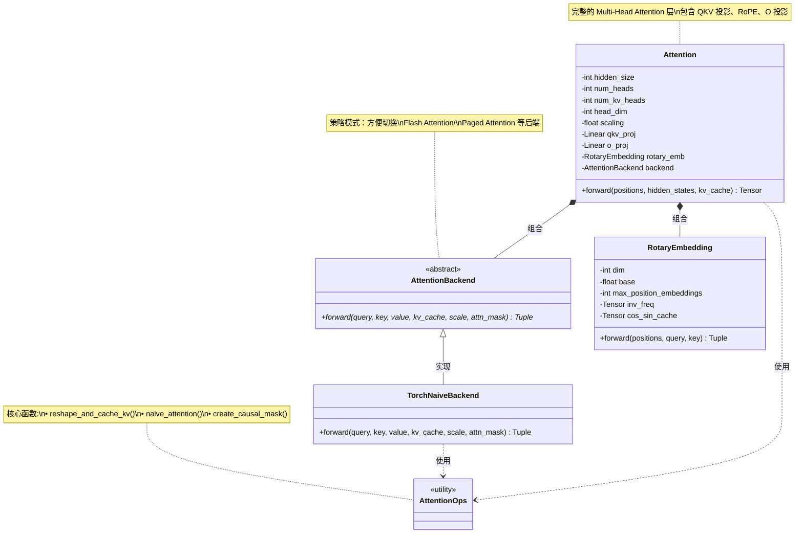

# Milestone 1 口述展示文档

> 本文档以类/函数为单位，详细讲解 M1 基础离线推理的实现过程，适合向小白讲解

---

## 📋 文档结构

本文档按照开发顺序讲解：

1. [Attention 系统实现](#1-attention-系统实现)
2. [模型工具实现](#2-模型工具实现)
3. [Qwen3 模型实现](#3-qwen3-模型实现)
4. [采样系统实现](#4-采样系统实现)
5. [Worker 和 Executor 实现](#5-worker-和-executor-实现)
6. [Engine 实现](#6-engine-实现)
7. [完整推理流程串讲](#7-完整推理流程串讲)

---

## 1. Attention 系统实现

### 架构类图



**类图说明**：

1. **核心设计模式**：
   - 使用**策略模式**：`AttentionBackend` 作为抽象接口，方便切换不同实现
   - `TorchNaiveBackend` 是 M1 的朴素实现，M3/M4 会添加优化版本

2. **组件职责**：
   - `AttentionOps`：提供底层工具函数（KV cache 管理、attention 计算、mask 创建）
   - `RotaryEmbedding`：旋转位置编码（RoPE）
   - `AttentionBackend`：执行实际的 attention 计算
   - `Attention`：完整的 attention 层，协调所有组件

3. **关系说明**：
   - **继承**：`TorchNaiveBackend` 实现 `AttentionBackend` 接口
   - **组合**：`Attention` 包含 `RotaryEmbedding` 和 `AttentionBackend`
   - **依赖**：`Attention` 和 `TorchNaiveBackend` 使用 `AttentionOps` 中的函数

---

### 1.1 为什么需要 Attention 系统？

**场景思考**：
```
问题：Transformer 生成每个 token 时，都要重新计算之前所有 token 的 K 和 V 吗？
答案：不需要！我们用 KV Cache 缓存已计算的 K 和 V

问题：如何设计一个灵活的 Attention 系统，方便后续切换优化实现？
答案：使用抽象接口 + 不同后端实现
```

### 1.2 `reshape_and_cache_kv()` - KV Cache 核心函数

**位置**：`folovllm/attention/ops.py`

**目的**：将新计算的 K、V 追加到缓存中

#### 实现思路

```python
def reshape_and_cache_kv(
    key: torch.Tensor,      # 新 token 的 K
    value: torch.Tensor,    # 新 token 的 V
    kv_cache: Tuple[torch.Tensor, torch.Tensor],  # 历史缓存
    slot_mapping: Optional[torch.Tensor] = None,  # M3 会用到
) -> Tuple[torch.Tensor, torch.Tensor]:
```

**口述讲解**：

**步骤1：判断是否首次调用**
```python
key_cache, value_cache = kv_cache

if key_cache.numel() == 0:
    # 第一个 token：初始化缓存
    # key shape: [batch_size, num_kv_heads, head_dim]
    # 需要增加 seq_len 维度 -> [batch_size, num_kv_heads, 1, head_dim]
    key_cache = key.unsqueeze(2)
    value_cache = value.unsqueeze(2)
```

**为什么这样设计**：
- 第一次没有缓存，需要创建一个 4D tensor
- `unsqueeze(2)` 在第 3 个维度（seq_len）增加维度

**步骤2：后续 token 追加到缓存**
```python
else:
    # 已有缓存：追加新的 K/V
    key = key.unsqueeze(2)  # [batch, heads, 1, dim]
    value = value.unsqueeze(2)
    
    # 沿着 seq_len 维度拼接
    key_cache = torch.cat([key_cache, key], dim=2)
    value_cache = torch.cat([value_cache, value], dim=2)
```

**关键点**：
- `torch.cat` 会创建新 tensor，复制所有数据
- M1 使用连续内存，M3 会改用 Paged Attention 优化

**完整流程图**：
```
第一个 token:
  key: [2, 4, 64] -> unsqueeze(2) -> [2, 4, 1, 64]
  
第二个 token:
  key: [2, 4, 64] -> unsqueeze(2) -> [2, 4, 1, 64]
  cache: [2, 4, 1, 64]
  cat -> [2, 4, 2, 64]
  
第 N 个 token:
  cache: [2, 4, N-1, 64]
  new: [2, 4, 1, 64]
  cat -> [2, 4, N, 64]
```

### 1.3 `naive_attention()` - 朴素 Attention 实现

**目的**：计算 Attention(Q, K, V)，不做任何优化

#### 数学原理

$$\text{Attention}(Q, K, V) = \text{softmax}\left(\frac{QK^T}{\sqrt{d_k}}\right) V$$

#### 实现讲解

**步骤1：处理 Grouped Query Attention (GQA)**

```python
batch_size, num_heads, seq_len_q, head_dim = query.shape
_, num_kv_heads, seq_len_k, _ = key.shape

if num_heads > num_kv_heads:
    # GQA: Q heads 多于 KV heads
    # 例如：32 个 Q heads, 8 个 KV heads
    # 需要重复 KV heads 以匹配
    num_repeats = num_heads // num_kv_heads
    key = key.unsqueeze(2).expand(...).reshape(...)
    value = value.unsqueeze(2).expand(...).reshape(...)
```

**为什么**：
- Qwen3 使用 GQA（16 Q heads, 2 KV heads）
- 减少 KV cache 大小，节省显存
- 但计算时需要将 KV 重复以匹配 Q

**步骤2：计算 Attention Scores**

```python
# Q @ K^T
attn_weights = torch.matmul(query, key.transpose(-2, -1)) * scale

# scale = 1/sqrt(head_dim)，防止梯度消失
```

**为什么要 scale**：
- Q·K 的方差会随 head_dim 增大
- 不 scale 的话，softmax 会退化成 one-hot（梯度消失）

**步骤3：应用 Causal Mask**

```python
if attn_mask is not None:
    # mask: [1, 1, seq_len_q, seq_len_k]
    # mask 值为 0（允许）或 -inf（禁止）
    attn_weights = attn_weights + attn_mask
```

**Causal Mask 示例**：
```
seq_len = 4 时的 mask (0=允许, -inf=禁止):
  0  -∞  -∞  -∞
  0   0  -∞  -∞
  0   0   0  -∞
  0   0   0   0
```

**步骤4：Softmax + 与 V 相乘**

```python
# Softmax (在 float32 下计算，避免数值不稳定)
attn_weights = F.softmax(attn_weights, dim=-1, dtype=torch.float32).to(query.dtype)

# @ V
output = torch.matmul(attn_weights, value)
```

### 1.4 `create_causal_mask()` - 创建因果掩码

**目的**：生成上三角 mask，确保每个 token 只能看到之前的 token

```python
def create_causal_mask(
    seq_len_q: int,    # Query 序列长度
    seq_len_k: int,    # Key 序列长度
    device: torch.device,
    dtype: torch.dtype = torch.float32,
) -> torch.Tensor:
```

#### 实现细节

```python
# 创建全 1 矩阵
mask = torch.ones(seq_len_q, seq_len_k, device=device, dtype=dtype)

# 保留上三角（不包括对角线）
# diagonal=seq_len_k - seq_len_q + 1 处理 decode 阶段
mask = torch.triu(mask, diagonal=seq_len_k - seq_len_q + 1)

# 将需要 mask 的位置设为 -inf
mask = mask.masked_fill(mask == 1, float('-inf'))

# 增加 batch 和 head 维度
mask = mask.unsqueeze(0).unsqueeze(0)  # [1, 1, seq_len_q, seq_len_k]
```

**关键理解**：

**Prefill 阶段**：`seq_len_q == seq_len_k`
```python
# 例如 seq_len = 3
diagonal = 3 - 3 + 1 = 1
mask = triu(ones(3, 3), diagonal=1)

结果：
[[0, 1, 1],      [[  0, -∞, -∞],
 [0, 0, 1],  ->   [  0,   0, -∞],
 [0, 0, 0]]       [  0,   0,   0]]
```

**Decode 阶段**：`seq_len_q = 1, seq_len_k = 5`（已有 4 个历史 token）
```python
diagonal = 5 - 1 + 1 = 5
mask = triu(ones(1, 5), diagonal=5)

结果：
[[0, 0, 0, 0, 0]]  # 全是 0，可以看所有历史 token
```

### 1.5 `AttentionBackend` - 抽象后端接口

**位置**：`folovllm/attention/backends/abstract.py`

**目的**：定义统一接口，方便切换不同 Attention 实现

```python
class AttentionBackend(ABC):
    @abstractmethod
    def forward(
        self,
        query: torch.Tensor,
        key: torch.Tensor,
        value: torch.Tensor,
        kv_cache: Optional[Tuple],
        scale: float,
        attn_mask: Optional[torch.Tensor] = None,
    ) -> Tuple[torch.Tensor, Tuple]:
        """
        返回: (output, updated_kv_cache)
        """
        raise NotImplementedError
```

**设计模式**：策略模式（Strategy Pattern）

**好处**：
```python
# M1: 使用 Naive backend
backend = TorchNaiveBackend()

# M3: 无缝切换到 Paged Attention
backend = PagedAttentionBackend()

# M4: 切换到 Flash Attention
backend = FlashAttentionBackend()
```

### 1.6 `TorchNaiveBackend` - 朴素实现

```python
class TorchNaiveBackend(AttentionBackend):
    def forward(self, query, key, value, kv_cache, scale, attn_mask=None):
        # 1. 初始化或更新缓存
        if kv_cache is None:
            key_cache = torch.empty(0)
            value_cache = torch.empty(0)
        else:
            key_cache, value_cache = kv_cache
        
        # 2. 处理 decode/prefill 两种情况
        if key.dim() == 3:  # Decode: [batch, heads, dim]
            key_cache, value_cache = reshape_and_cache_kv(...)
            key = key_cache
            value = value_cache
        elif key.dim() == 4:  # Prefill: [batch, heads, seq_len, dim]
            if key_cache.numel() == 0:
                key_cache = key
                value_cache = value
            else:
                key_cache = torch.cat([key_cache, key], dim=2)
                value_cache = torch.cat([value_cache, value], dim=2)
            key = key_cache
            value = value_cache
        
        # 3. 运行 attention
        output = naive_attention(query, key, value, scale, attn_mask)
        
        return output, (key_cache, value_cache)
```

**关键点**：
- 通过 `key.dim()` 判断是 decode 还是 prefill
- Decode: key 是 3D，需要追加到缓存
- Prefill: key 是 4D，直接作为缓存

### 1.7 `Attention` Layer - 通用 Attention 层

**位置**：`folovllm/model_executor/layers/attention.py`

**目的**：封装完整的 Attention 模块，包括 QKV 投影、RoPE、Attention 计算、输出投影

#### 类结构

```python
class Attention(nn.Module):
    def __init__(
        self,
        hidden_size: int,        # 隐藏层大小
        num_heads: int,          # Q heads 数量
        num_kv_heads: int,       # KV heads 数量（GQA）
        head_dim: Optional[int], # 每个 head 的维度
        max_position_embeddings: int,
        rope_theta: float,
        rope_scaling: Optional[float],
        bias: bool,
        backend: Optional[AttentionBackend],
    ):
```

#### 初始化组件

```python
# 1. QKV 投影（合并为一个 linear）
self.qkv_proj = nn.Linear(
    hidden_size,
    self.q_size + 2 * self.kv_size,  # Q + K + V
    bias=bias,
)

# 2. 输出投影
self.o_proj = nn.Linear(self.q_size, hidden_size, bias=bias)

# 3. RoPE
self.rotary_emb = RotaryEmbedding(...)

# 4. Attention backend
self.backend = backend or TorchNaiveBackend()

# 5. KV cache（外部设置）
self.kv_cache = None
```

**为什么合并 QKV 投影**：
- 单个 linear layer 比三个分离的更高效
- 减少 kernel launch overhead
- 内存访问更友好

#### Forward 实现

```python
def forward(
    self,
    positions: torch.Tensor,     # 位置索引
    hidden_states: torch.Tensor, # [batch, seq_len, hidden_size]
    kv_cache: Optional[Tuple],
) -> torch.Tensor:
```

**步骤1：QKV 投影和 Reshape**

```python
# QKV 投影
qkv = self.qkv_proj(hidden_states)  # [batch, seq_len, q_size + 2*kv_size]

# 分割 Q、K、V
q, k, v = qkv.split([self.q_size, self.kv_size, self.kv_size], dim=-1)

# Reshape 为 multi-head 格式
q = q.view(batch_size, seq_len, self.num_heads, self.head_dim)
k = k.view(batch_size, seq_len, self.num_kv_heads, self.head_dim)
v = v.view(batch_size, seq_len, self.num_kv_heads, self.head_dim)

# Transpose 到 [batch, heads, seq_len, dim]
q = q.transpose(1, 2)
k = k.transpose(1, 2)
v = v.transpose(1, 2)
```

**步骤2：应用 RoPE**

```python
q, k = self.rotary_emb(positions, q, k)
```

**步骤3：处理 Decode 情况**

```python
if seq_len == 1:
    # Decode: 移除 seq_len 维度
    k = k.squeeze(2)  # [batch, num_kv_heads, head_dim]
    v = v.squeeze(2)
```

**步骤4：创建 Causal Mask（支持增量 Prefill）**

这里的设计考虑了增量 prefill 的场景：
- **增量 prefill**：当 KV cache 中已有部分 tokens，新来的 tokens 需要与历史 tokens 进行 attention
- **cache_len**：已缓存的 token 数量
- **total_len**：缓存长度 + 当前序列长度，表示完整的上下文长度
- **causal mask**：确保当前 tokens 只能看到自己和之前的 tokens（包括缓存中的）

这种设计使得模型可以：
1. 处理长序列的分块 prefill
2. 在已有 KV cache 基础上继续生成
3. 保持因果性约束的正确性

```python
attn_mask = None
if seq_len > 1:
    cache_len = 0
    if kv_cache is not None and kv_cache[0].numel() > 0:
        cache_len = kv_cache[0].shape[2]
    
    total_len = cache_len + seq_len
    attn_mask = create_causal_mask(seq_len, total_len, device, dtype)
```

**步骤5：运行 Attention**

```python
output, kv_cache = self.backend.forward(
    q, k, v, kv_cache, self.scaling, attn_mask
)
```

**步骤6：输出投影**

```python
# Transpose 回来: [batch, heads, seq_len, dim] -> [batch, seq_len, heads, dim]
output = output.transpose(1, 2).contiguous()

# Reshape: [batch, seq_len, num_heads * head_dim]
output = output.view(batch_size, seq_len, self.q_size)

# 输出投影
output = self.o_proj(output)
```

---

## 2. 模型工具实现

### 2.1 `RMSNorm` - Root Mean Square 归一化

**位置**：`folovllm/model_executor/models/utils.py`

**为什么用 RMSNorm 而不是 LayerNorm**：
- LayerNorm: $\text{norm}(x) = \frac{x - \mu}{\sigma}$（需要计算均值和方差）
- RMSNorm: $\text{norm}(x) = \frac{x}{\text{RMS}(x)}$（只需要计算 RMS）
- **更快**：少一个减法和均值计算
- **效果相当**：实验表明 re-centering（减均值）对性能提升有限

#### 数学公式

$$\text{RMS}(x) = \sqrt{\frac{1}{d}\sum_{i=1}^d x_i^2}$$

$$\text{RMSNorm}(x) = \frac{x}{\text{RMS}(x)} \cdot \gamma$$

#### 实现讲解

```python
class RMSNorm(nn.Module):
    def __init__(self, hidden_size: int, eps: float = 1e-6):
        super().__init__()
        self.weight = nn.Parameter(torch.ones(hidden_size))
        self.variance_epsilon = eps
```

**Forward with Fused Residual**：

```python
def forward(
    self,
    hidden_states: torch.Tensor,
    residual: Optional[torch.Tensor] = None,
) -> Tuple[torch.Tensor, torch.Tensor]:
    input_dtype = hidden_states.dtype
    
    # Fused residual: 先加再归一化
    if residual is not None:
        new_residual = hidden_states + residual
        hidden_states = new_residual.to(torch.float32)
    else:
        new_residual = hidden_states
        hidden_states = hidden_states.to(torch.float32)
    
    # 计算 RMS
    variance = hidden_states.pow(2).mean(-1, keepdim=True)
    hidden_states = hidden_states * torch.rsqrt(variance + self.variance_epsilon)
    
    # 应用 weight
    hidden_states = self.weight * hidden_states.to(input_dtype)
    
    return hidden_states, new_residual
```

**Fused Residual 的好处**：
```python
# 不 fused（两次内存访问）:
x = x + residual
x = norm(x)

# Fused（一次内存访问）:
x_norm, residual = norm(x, residual)
```

**为什么返回两个值**：
- `hidden_states`: 归一化后的输出（给下一层）
- `new_residual`: `x + residual`（给下下层作为 residual）

### 2.2 `RotaryEmbedding` - 旋转位置编码

**RoPE 的核心思想**：不在输入加位置编码，而是**在 attention 中旋转 Q 和 K**

#### 数学原理

对于位置 $m$ 和 $n$ 的 token：

$$\text{score}(m, n) = q_m^T k_n = \text{rotate}(q, m\theta)^T \text{rotate}(k, n\theta)$$

**关键性质**：
$$\text{rotate}(q, m\theta)^T \text{rotate}(k, n\theta) = \text{rotate}(q^T k, (m-n)\theta)$$

**结论**：Attention score 只依赖**相对位置** $m-n$！

#### 实现细节

**步骤1：预计算旋转频率**

```python
def __init__(self, dim: int, max_position_embeddings: int, base: float):
    # 计算频率（几何级数）
    inv_freq = 1.0 / (base ** (torch.arange(0, dim, 2).float() / dim))
    self.register_buffer("inv_freq", inv_freq)
    
    # θ_i = base^(-2i/d)
    # 例如 dim=64, base=10000:
    # θ_0 = 1.0
    # θ_1 = 0.1
    # θ_2 = 0.01
    # ...
```

**步骤2：更新 cos/sin 缓存**

```python
def _update_cos_sin_cache(self, seq_len, device, dtype):
    # 生成位置索引
    t = torch.arange(seq_len, device=device)
    
    # 计算频率
    freqs = torch.outer(t, self.inv_freq)  # [seq_len, dim//2]
    
    # 重复一次（用于实部和虚部）
    emb = torch.cat([freqs, freqs], dim=-1)  # [seq_len, dim]
    
    # 计算 cos 和 sin
    self._cos_cached = emb.cos()
    self._sin_cached = emb.sin()
```

**步骤3：应用旋转**

```python
def forward(self, positions, query, key):
    # 获取 cos/sin
    max_pos = positions.max() + 1
    self._update_cos_sin_cache(max_pos, positions.device, query.dtype)
    
    cos = self._cos_cached[positions]
    sin = self._sin_cached[positions]
    
    # 应用旋转
    query = self._apply_rotary_emb(query, cos, sin)
    key = self._apply_rotary_emb(key, cos, sin)
    
    return query, key
```

**步骤4：旋转实现**

```python
@staticmethod
def _apply_rotary_emb(x, cos, sin):
    # 分成两半
    x1 = x[..., : x.shape[-1] // 2]
    x2 = x[..., x.shape[-1] // 2 :]
    
    # 维度对齐
    if x.dim() == 4:  # [batch, heads, seq_len, dim]
        if cos.dim() == 3:  # [batch, seq_len, dim]
            cos = cos.unsqueeze(1)  # [batch, 1, seq_len, dim]
            sin = sin.unsqueeze(1)
    elif x.dim() == 3:  # [batch, heads, dim]
        if cos.dim() == 2:  # [batch, dim]
            cos = cos.unsqueeze(1)  # [batch, 1, dim]
            sin = sin.unsqueeze(1)
    
    # 分割 cos/sin
    cos1 = cos[..., : cos.shape[-1] // 2]
    cos2 = cos[..., cos.shape[-1] // 2 :]
    sin1 = sin[..., : sin.shape[-1] // 2]
    sin2 = sin[..., sin.shape[-1] // 2 :]
    
    # 应用旋转（复数乘法）
    rotated = torch.cat([
        x1 * cos1 - x2 * sin1,  # 实部
        x1 * sin2 + x2 * cos2,  # 虚部
    ], dim=-1)
    
    return rotated
```

**几何理解**：
```
原向量: [x1, x2]
旋转后: [x1*cos - x2*sin, x1*sin + x2*cos]

这就是 2D 平面上的旋转矩阵：
[cos  -sin] [x1]
[sin   cos] [x2]
```

### 2.3 `SiLUAndMul` - Fused 激活函数

**SiLU (Swish)**：$\text{SiLU}(x) = x \cdot \sigma(x)$

**用于 Gated MLP**：
```python
# 不 fused:
gate = linear_gate(x)
up = linear_up(x)
output = silu(gate) * up

# Fused:
gate_up = linear_gate_up(x)  # 一次 linear
output = silu_and_mul(gate_up)  # 一次 kernel
```

#### 实现

```python
class SiLUAndMul(nn.Module):
    def forward(self, x: torch.Tensor) -> torch.Tensor:
        # x: [..., 2 * hidden_size]
        gate, up = x.chunk(2, dim=-1)
        return F.silu(gate) * up
```

**为什么 Fused**：
- 减少内存访问
- 减少 kernel launch
- 提升性能

---

## 3. Qwen3 模型实现

### 3.1 模型架构概览

```
Qwen3ForCausalLM
├── Qwen3Model
│   ├── Embedding
│   ├── Qwen3DecoderLayer × N
│   │   ├── Qwen3Attention
│   │   │   ├── QKV Projection
│   │   │   ├── RoPE
│   │   │   ├── Attention
│   │   │   └── O Projection
│   │   ├── RMSNorm
│   │   ├── Qwen3MLP
│   │   │   ├── Gate + Up Projection (merged)
│   │   │   ├── SiLU Activation
│   │   │   └── Down Projection
│   │   └── RMSNorm
│   └── Final RMSNorm
└── LM Head
```

### 3.2 `Qwen3Attention` - Attention 层封装

```python
class Qwen3Attention(nn.Module):
    def __init__(self, config: Qwen2Config):
        super().__init__()
        # 使用我们的通用 Attention 层
        self.attn = Attention(
            hidden_size=config.hidden_size,
            num_heads=config.num_attention_heads,
            num_kv_heads=config.num_key_value_heads,
            head_dim=getattr(config, 'head_dim', None),
            max_position_embeddings=config.max_position_embeddings,
            rope_theta=getattr(config, "rope_theta", 1000000.0),
            bias=getattr(config, 'attention_bias', True),
        )
    
    def forward(self, positions, hidden_states, kv_cache=None):
        return self.attn(positions, hidden_states, kv_cache)
```

**设计思路**：
- 薄封装，主要逻辑在通用 `Attention` 类
- 从 config 提取参数
- 方便后续替换不同的 attention 实现

### 3.3 `Qwen3MLP` - Gated FFN

```python
class Qwen3MLP(nn.Module):
    def __init__(self, config: Qwen2Config):
        super().__init__()
        # Gate 和 Up 投影合并
        self.gate_up_proj = nn.Linear(
            config.hidden_size,
            2 * config.intermediate_size,
            bias=False,
        )
        # Down 投影
        self.down_proj = nn.Linear(
            config.intermediate_size,
            config.hidden_size,
            bias=False,
        )
        # SiLU + 逐元素乘法
        self.act_fn = SiLUAndMul()
    
    def forward(self, hidden_states):
        # [h] -> [2*i]
        gate_up = self.gate_up_proj(hidden_states)
        # [2*i] -> [i]
        hidden_states = self.act_fn(gate_up)
        # [i] -> [h]
        hidden_states = self.down_proj(hidden_states)
        return hidden_states
```

**数学表达**：
$$\text{MLP}(x) = W_{\text{down}} \left( \text{SiLU}(W_{\text{gate}}x) \odot W_{\text{up}}x \right)$$

### 3.4 `Qwen3DecoderLayer` - Transformer 层

```python
class Qwen3DecoderLayer(nn.Module):
    def __init__(self, config, layer_idx):
        super().__init__()
        self.self_attn = Qwen3Attention(config)
        self.mlp = Qwen3MLP(config)
        self.input_layernorm = RMSNorm(config.hidden_size, eps=config.rms_norm_eps)
        self.post_attention_layernorm = RMSNorm(config.hidden_size, eps=config.rms_norm_eps)
```

**Forward with Pre-Norm + Fused Residual**：

```python
def forward(self, positions, hidden_states, residual, kv_cache=None):
    # 1. Attention block
    if residual is None:
        residual = hidden_states
        hidden_states, _ = self.input_layernorm(hidden_states, residual=None)
    else:
        hidden_states, residual = self.input_layernorm(hidden_states, residual)
    
    hidden_states = self.self_attn(positions, hidden_states, kv_cache)
    
    # 2. MLP block
    hidden_states, residual = self.post_attention_layernorm(hidden_states, residual)
    hidden_states = self.mlp(hidden_states)
    
    return hidden_states, residual
```

**Residual 流程图**：
```
Layer 0:
  input: x₀
  residual = None
  norm(x₀) -> attn -> h₁
  residual = x₀ (from norm)
  norm(h₁, residual=x₀) -> h₁ + x₀ -> mlp -> h₂
  residual = h₁ + x₀
  return h₂, residual

Layer 1:
  input: h₂, residual = h₁ + x₀
  norm(h₂, residual=h₁+x₀) -> (h₂+h₁+x₀) -> attn -> h₃
  residual = h₂ + h₁ + x₀
  ...
```

### 3.5 `Qwen3Model` - 完整模型

```python
class Qwen3Model(nn.Module):
    def __init__(self, config):
        super().__init__()
        self.embed_tokens = nn.Embedding(config.vocab_size, config.hidden_size)
        self.layers = nn.ModuleList([
            Qwen3DecoderLayer(config, layer_idx)
            for layer_idx in range(config.num_hidden_layers)
        ])
        self.norm = RMSNorm(config.hidden_size, eps=config.rms_norm_eps)
    
    def forward(self, input_ids, positions, kv_caches=None):
        # Embedding
        hidden_states = self.embed_tokens(input_ids)
        
        # Transformer layers
        residual = None
        for layer_idx, layer in enumerate(self.layers):
            kv_cache = kv_caches[layer_idx] if kv_caches else None
            hidden_states, residual = layer(positions, hidden_states, residual, kv_cache)
        
        # Final norm
        hidden_states, _ = self.norm(hidden_states, residual)
        
        return hidden_states
```

### 3.6 使用 HuggingFace 模型（M1 实际方案）

**为什么改用 HF 模型**：
- 自定义模型架构与 HF 不完全匹配（qkv_proj vs q/k/v_proj）
- HF 模型有 q_norm 和 k_norm 层
- 权重加载复杂，为了 M1 稳定性，直接用 HF

**封装方法**：

```python
# folovllm/model_loader.py
def _wrap_model_for_folovllm(self, model):
    # 添加 compute_logits 方法
    if not hasattr(model, 'compute_logits'):
        def compute_logits(hidden_states):
            return model.lm_head(hidden_states)
        
        import types
        model.compute_logits = types.MethodType(compute_logits, model)
    
    return model
```

**兼容 HF 的 KV Cache**：

```python
# folovllm/worker/model_runner.py
# HF 模型使用 past_key_values
outputs = self.model(
    input_ids=input_ids,
    position_ids=positions,
    past_key_values=self.past_key_values,  # HF 的 cache
    use_cache=True,
    return_dict=True,
)
logits = outputs.logits
self.past_key_values = outputs.past_key_values  # 更新 cache
```

---

## 4. 采样系统实现

### 4.1 采样策略概述

```
Logits [vocab_size]
  ↓ apply temperature
Logits / T
  ↓ apply min_p
Filtered Logits
  ↓ apply top_k
Filtered Logits
  ↓ apply top_p
Final Filtered Logits
  ↓ softmax
Probabilities
  ↓ greedy or sample
Next Token
```

### 4.2 `apply_top_k_filtering()` - Top-k 过滤

**目的**：只保留概率最高的 k 个 token

```python
def apply_top_k_filtering(logits: torch.Tensor, top_k: int) -> torch.Tensor:
    if top_k <= 0:
        return logits  # 不过滤
    
    # 获取 top-k 值和索引
    top_k = min(top_k, logits.size(-1))
    top_k_values, top_k_indices = torch.topk(logits, top_k, dim=-1)
    
    # 创建全 -inf tensor
    filtered_logits = torch.full_like(logits, float('-inf'))
    
    # 只填入 top-k 的值
    filtered_logits.scatter_(-1, top_k_indices, top_k_values)
    
    return filtered_logits
```

**示例**：
```python
logits = [5.0, 3.0, 1.0, 4.0, 2.0]
top_k = 3

top_k_values = [5.0, 4.0, 3.0]
top_k_indices = [0, 3, 1]

filtered = [-inf, 3.0, -inf, 4.0, -inf]
                 ↑              ↑
              保留         保留
```

### 4.3 `apply_top_p_filtering()` - Nucleus 采样

**目的**：动态选择，保留累积概率 ≥ p 的最小 token 集合

```python
def apply_top_p_filtering(logits: torch.Tensor, top_p: float) -> torch.Tensor:
    if top_p >= 1.0:
        return logits
    
    # 1. 按概率排序
    sorted_logits, sorted_indices = torch.sort(logits, descending=True, dim=-1)
    
    # 2. 计算累积概率
    sorted_probs = F.softmax(sorted_logits, dim=-1)
    cumulative_probs = torch.cumsum(sorted_probs, dim=-1)
    
    # 3. 找出需要移除的 token
    sorted_indices_to_remove = cumulative_probs > top_p
    
    # 4. 右移一位（保留第一个超过 p 的 token）
    sorted_indices_to_remove[..., 1:] = sorted_indices_to_remove[..., :-1].clone()
    sorted_indices_to_remove[..., 0] = False  # 至少保留一个
    
    # 5. 映射回原始顺序
    indices_to_remove = sorted_indices_to_remove.scatter(
        -1, sorted_indices, sorted_indices_to_remove
    )
    
    # 6. 设为 -inf
    filtered_logits = logits.masked_fill(indices_to_remove, float('-inf'))
    
    return filtered_logits
```

**示例**：
```python
probs = [0.5, 0.3, 0.1, 0.05, 0.05]
top_p = 0.8

sorted_probs = [0.5, 0.3, 0.1, 0.05, 0.05]
cumsum       = [0.5, 0.8, 0.9, 0.95, 1.0]
                     ↑
                 到这里累积概率 >= 0.8

保留: [0.5, 0.3, 0.1]（3 个token）
```

### 4.4 `apply_min_p_filtering()` - 最小概率过滤

**目的**：过滤掉概率 < min_p * max_prob 的 token

```python
def apply_min_p_filtering(logits: torch.Tensor, min_p: float) -> torch.Tensor:
    if min_p <= 0.0:
        return logits
    
    # 计算概率
    probs = F.softmax(logits, dim=-1)
    
    # 找最大概率
    max_probs, _ = torch.max(probs, dim=-1, keepdim=True)
    
    # 阈值
    threshold = min_p * max_probs
    
    # 过滤
    mask = probs < threshold
    filtered_logits = logits.masked_fill(mask, float('-inf'))
    
    return filtered_logits
```

**示例**：
```python
probs = [0.6, 0.2, 0.1, 0.05, 0.05]
min_p = 0.1

max_prob = 0.6
threshold = 0.1 * 0.6 = 0.06

保留: [0.6, 0.2, 0.1]
过滤: [0.05, 0.05]（< 0.06）
```

### 4.5 `Sampler` - 完整采样器

```python
class Sampler:
    def __init__(self):
        self._generator = None  # 随机数生成器
    
    def sample(self, logits, sampling_params):
        # 1. 设置随机种子
        if sampling_params.seed is not None:
            if self._generator is None:
                self._generator = torch.Generator(device=logits.device)
            self._generator.manual_seed(sampling_params.seed)
        
        # 2. Temperature scaling
        if sampling_params.temperature > 0:
            logits = logits / sampling_params.temperature
        
        # 3. 依次应用过滤
        if sampling_params.min_p > 0:
            logits = apply_min_p_filtering(logits, sampling_params.min_p)
        
        if sampling_params.top_k > 0:
            logits = apply_top_k_filtering(logits, sampling_params.top_k)
        
        if sampling_params.top_p < 1.0:
            logits = apply_top_p_filtering(logits, sampling_params.top_p)
        
        # 4. 采样
        if sampling_params.sampling_type == SamplingType.GREEDY:
            sampled_tokens = torch.argmax(logits, dim=-1)
        else:
            probs = F.softmax(logits, dim=-1)
            sampled_tokens = torch.multinomial(
                probs, num_samples=1, generator=self._generator
            ).squeeze(-1)
        
        # 5. 可选：计算 log_probs
        log_probs = None
        if sampling_params.logprobs is not None:
            log_probs = F.log_softmax(logits, dim=-1)
            log_probs = log_probs.gather(-1, sampled_tokens.unsqueeze(-1)).squeeze(-1)
        
        return sampled_tokens, log_probs
```

### 4.6 `check_stop_conditions()` - 停止条件检查

```python
def check_stop_conditions(
    self,
    token_ids: List[int],      # 已生成的 token
    token_text: str,            # 解码后的文本
    sampling_params: SamplingParams,
    eos_token_id: Optional[int],
) -> Tuple[bool, Optional[str]]:
    # 1. 检查 max_tokens
    if sampling_params.max_tokens is not None:
        if len(token_ids) >= sampling_params.max_tokens:
            return True, "length"
    
    # 2. 检查 EOS token
    if not sampling_params.ignore_eos and eos_token_id is not None:
        if len(token_ids) > 0 and token_ids[-1] == eos_token_id:
            return True, "stop"
    
    # 3. 检查 stop_token_ids
    if sampling_params.stop_token_ids:
        if len(token_ids) > 0 and token_ids[-1] in sampling_params.stop_token_ids:
            return True, "stop"
    
    # 4. 检查 stop strings
    if sampling_params.stop:
        for stop_str in sampling_params.stop:
            if stop_str in token_text:
                return True, "stop"
    
    return False, None
```

---

## 5. Worker 和 Executor 实现

### 5.1 系统架构

```
LLMEngine
  ↓ 调用
GPUExecutor (接口层)
  ↓ 管理
GPUWorker (设备管理)
  ↓ 执行
ModelRunner (模型运行)
  ↓ 前向传播
Model
```

### 5.2 `ModelRunner` - 模型运行器

**职责**：
1. 准备模型输入（input_ids, positions）
2. 管理 KV cache
3. 执行模型前向传播
4. 返回 logits

#### 初始化

```python
class ModelRunner:
    def __init__(self, model, model_config, device):
        self.model = model
        self.model_config = model_config
        self.device = device
        
        # KV caches（自定义模型）
        self.kv_caches = None
        # past_key_values（HF 模型）
        self.past_key_values = None
        
        # 层数
        if hasattr(model, 'model') and hasattr(model.model, 'layers'):
            self.num_layers = len(model.model.layers)
        else:
            self.num_layers = 0
```

#### 准备输入

```python
def prepare_inputs(self, token_ids, start_pos=0):
    batch_size, seq_len = token_ids.shape
    
    # 创建 position indices
    positions = torch.arange(
        start_pos,
        start_pos + seq_len,
        device=self.device,
        dtype=torch.long,
    )
    # Expand for batch
    positions = positions.unsqueeze(0).expand(batch_size, -1)
    
    return token_ids, positions
```

**为什么需要 start_pos**：
```
Prefill: start_pos=0
  tokens: [1, 2, 3, 4]
  positions: [0, 1, 2, 3]

Decode step 1: start_pos=4
  tokens: [5]
  positions: [4]

Decode step 2: start_pos=5
  tokens: [6]
  positions: [5]
```

#### 执行模型

```python
@torch.no_grad()
def execute_model(self, token_ids, start_pos=0):
    # 准备输入
    input_ids, positions = self.prepare_inputs(token_ids, start_pos)
    
    # 检查是否是 HF 模型
    if hasattr(self.model, 'forward') and 'position_ids' in str(self.model.forward.__code__.co_varnames):
        # HuggingFace 模型
        outputs = self.model(
            input_ids=input_ids,
            position_ids=positions,
            past_key_values=self.past_key_values,  # HF cache
            use_cache=True,
            return_dict=True,
        )
        logits = outputs.logits
        self.past_key_values = outputs.past_key_values  # 更新 cache
    else:
        # 自定义模型（M1 实际不用，预留）
        if self.kv_caches is None:
            self.initialize_kv_caches(batch_size=input_ids.shape[0])
        
        hidden_states = self.model(
            input_ids=input_ids,
            positions=positions,
            kv_caches=self.kv_caches,
        )
        
        # 更新 caches
        for layer_idx, layer in enumerate(self.model.model.layers):
            if hasattr(layer.self_attn, 'attn') and hasattr(layer.self_attn.attn, 'kv_cache'):
                self.kv_caches[layer_idx] = layer.self_attn.attn.kv_cache
        
        logits = self.model.compute_logits(hidden_states)
    
    return logits
```

#### 获取下一个 token 的 logits

```python
def get_next_token_logits(self, token_ids, start_pos=0):
    # 执行模型
    logits = self.execute_model(token_ids, start_pos)
    
    # 返回最后一个位置的 logits
    return logits[:, -1, :]  # [batch, vocab_size]
```

### 5.3 `GPUWorker` - GPU 工作器

**职责**：管理 GPU 设备和模型，提供执行接口

```python
class GPUWorker:
    def __init__(self, model_config, device=None):
        self.model_config = model_config
        
        # 确定设备
        if device is None:
            device = "cuda" if torch.cuda.is_available() else "cpu"
        self.device = torch.device(device)
        
        # 加载模型
        loader = ModelLoader(model_config)
        self.model = loader.load_model(device=str(self.device))
        
        # 创建 model runner
        self.model_runner = ModelRunner(self.model, model_config, self.device)
    
    def get_next_token_logits(self, token_ids, start_pos=0):
        # 移动到设备
        if token_ids.device != self.device:
            token_ids = token_ids.to(self.device)
        
        return self.model_runner.get_next_token_logits(token_ids, start_pos)
    
    def clear_kv_caches(self):
        self.model_runner.clear_kv_caches()
```

### 5.4 `GPUExecutor` - 执行器

**职责**：统一的执行接口，为分布式预留空间

```python
class GPUExecutor:
    def __init__(self, model_config, device=None):
        self.model_config = model_config
        self.device = device
        
        # M1: 单 GPU worker
        self.worker = GPUWorker(model_config, device)
    
    def get_next_token_logits(self, token_ids, start_pos=0):
        return self.worker.get_next_token_logits(token_ids, start_pos)
    
    def clear_kv_caches(self):
        self.worker.clear_kv_caches()
```

**未来扩展（M6）**：
```python
# 多 GPU tensor parallelism
class GPUExecutor:
    def __init__(self, ...):
        self.workers = [GPUWorker(..., device=f"cuda:{i}") for i in range(num_gpus)]
    
    def get_next_token_logits(self, ...):
        # 分发到多个 worker
        # All-reduce 结果
        ...
```

---

## 6. Engine 实现

### 6.1 `InputProcessor` - 输入处理器

**职责**：
1. Tokenize prompt
2. 创建 Request 对象
3. 解码 token IDs 为文本

```python
class InputProcessor:
    def __init__(self, tokenizer):
        self.tokenizer = tokenizer
    
    def process_request(self, prompt, sampling_params, request_id=None):
        # 生成 request ID
        if request_id is None:
            request_id = str(uuid.uuid4())
        
        # Tokenize
        prompt_token_ids = self.tokenizer.encode(prompt, add_special_tokens=True)
        
        # 创建 Request
        request = Request(
            request_id=request_id,
            prompt=prompt,
            prompt_token_ids=prompt_token_ids,
            sampling_params=sampling_params,
        )
        
        return request
    
    def decode_tokens(self, token_ids, skip_special_tokens=True):
        return self.tokenizer.decode(token_ids, skip_special_tokens=skip_special_tokens)
```

### 6.2 `LLMEngine` - 主引擎

**职责**：
1. 初始化所有组件
2. 提供 `generate()` 接口
3. 执行完整的生成循环
4. 构造输出

#### 初始化

```python
class LLMEngine:
    def __init__(self, model_config, device=None):
        self.model_config = model_config
        
        # 加载 tokenizer
        loader = ModelLoader(model_config)
        self.tokenizer = loader.load_tokenizer()
        
        # 创建 executor
        self.executor = GPUExecutor(model_config, device)
        
        # 创建 processor 和 sampler
        self.processor = InputProcessor(self.tokenizer)
        self.sampler = Sampler()
```

#### 生成接口

```python
def generate(self, prompt, sampling_params=None, return_outputs=True):
    # 处理输入
    if isinstance(prompt, str):
        if sampling_params is None:
            sampling_params = SamplingParams()
        request = self.processor.process_request(prompt, sampling_params)
    else:
        request = prompt
        sampling_params = request.sampling_params
    
    # 清空缓存
    self.executor.clear_kv_caches()
    
    # 生成
    output = self._generate_single(request)
    
    return output
```

#### 单请求生成

```python
def _generate_single(self, request):
    sampling_params = request.sampling_params
    
    # 获取第一个序列（M1 只支持 n=1）
    sequences = request.get_seqs()
    seq = sequences[0]
    seq.status = SequenceStatus.RUNNING
    
    # Prefill 阶段
    prompt_token_ids = seq.data.prompt_token_ids
    prompt_len = len(prompt_token_ids)
    
    start_time = time.time()
    input_tokens = torch.tensor([prompt_token_ids], dtype=torch.long)
    logits = self.executor.get_next_token_logits(input_tokens, start_pos=0)
    
    # 采样第一个 token
    next_tokens, _ = self.sampler.sample(logits, sampling_params)
    next_token_id = next_tokens[0].item()
    seq.add_token_id(next_token_id)
    
    first_token_time = time.time()
    ttft = first_token_time - start_time
    
    # Decode 阶段
    decode_times = []
    for step in range(1, sampling_params.max_tokens or 100):
        decode_start = time.time()
        
        # 检查停止条件
        output_text = self.processor.decode_tokens(
            seq.data.output_token_ids,
            skip_special_tokens=sampling_params.skip_special_tokens,
        )
        should_stop, finish_reason = self.sampler.check_stop_conditions(
            seq.data.output_token_ids,
            output_text,
            sampling_params,
            eos_token_id=self.tokenizer.eos_token_id,
        )
        
        if should_stop:
            seq.status = SequenceStatus.FINISHED_STOPPED if finish_reason == "stop" \
                else SequenceStatus.FINISHED_LENGTH_CAPPED
            break
        
        # 生成下一个 token
        input_tokens = torch.tensor([[next_token_id]], dtype=torch.long)
        logits = self.executor.get_next_token_logits(input_tokens, start_pos=prompt_len + step)
        
        # 采样
        next_tokens, _ = self.sampler.sample(logits, sampling_params)
        next_token_id = next_tokens[0].item()
        seq.add_token_id(next_token_id)
        
        decode_times.append(time.time() - decode_start)
    
    # 构造输出
    output = self._build_output(request)
    
    # 添加性能指标
    total_time = time.time() - start_time
    num_tokens = len(seq.data.output_token_ids)
    tpot = sum(decode_times) / len(decode_times) if decode_times else 0
    
    output.metrics = {
        "ttft": ttft,
        "tpot": tpot,
        "total_time": total_time,
        "throughput": num_tokens / total_time if total_time > 0 else 0,
    }
    
    return output
```

#### 构造输出

```python
def _build_output(self, request):
    sequences = request.get_seqs()
    
    # 构造 completion outputs
    completion_outputs = []
    for idx, seq in enumerate(sequences):
        # 解码输出
        output_text = self.processor.decode_tokens(
            seq.data.output_token_ids,
            skip_special_tokens=request.sampling_params.skip_special_tokens,
        )
        
        # 确定 finish reason
        finish_reason = None
        if seq.status == SequenceStatus.FINISHED_STOPPED:
            finish_reason = "stop"
        elif seq.status == SequenceStatus.FINISHED_LENGTH_CAPPED:
            finish_reason = "length"
        
        completion_output = CompletionOutput(
            index=idx,
            text=output_text,
            token_ids=seq.data.output_token_ids.copy(),
            cumulative_logprob=None,
            logprobs=None,
            finish_reason=finish_reason,
        )
        completion_outputs.append(completion_output)
    
    # 检查是否完成
    finished = all(seq.is_finished() for seq in sequences)
    
    output = RequestOutput(
        request_id=request.request_id,
        prompt=request.prompt,
        prompt_token_ids=request.prompt_token_ids,
        outputs=completion_outputs,
        finished=finished,
    )
    
    return output
```

---

## 7. 完整推理流程串讲

### 7.1 用户调用

```python
from folovllm import LLMEngine, ModelConfig, SamplingParams

# 1. 创建配置
config = ModelConfig(
    model="Qwen/Qwen3-0.6B",
    dtype="float16",
    trust_remote_code=True,
)

# 2. 初始化引擎
engine = LLMEngine(config, device="cuda")

# 3. 设置采样参数
params = SamplingParams(
    temperature=0.7,
    top_k=50,
    top_p=0.95,
    max_tokens=100,
)

# 4. 生成
output = engine.generate("Hello, how are you?", params)

# 5. 获取结果
print(output.outputs[0].text)
print(f"TTFT: {output.metrics['ttft']*1000:.2f} ms")
```

### 7.2 内部流程详解

#### Step 1: Engine 初始化

```
LLMEngine.__init__()
  ├─ ModelLoader.load_tokenizer()
  │    └─ AutoTokenizer.from_pretrained()
  │
  ├─ GPUExecutor(model_config, device)
  │    └─ GPUWorker(model_config, device)
  │         ├─ ModelLoader.load_model()
  │         │    ├─ AutoModelForCausalLM.from_pretrained()
  │         │    └─ _wrap_model_for_folovllm()  # 添加 compute_logits
  │         │
  │         └─ ModelRunner(model, config, device)
  │
  ├─ InputProcessor(tokenizer)
  └─ Sampler()
```

#### Step 2: 处理请求

```
engine.generate("Hello, how are you?", params)
  └─ processor.process_request()
       ├─ tokenizer.encode("Hello, how are you?")
       │    → [9906, 11, 1268, 527, 499, 30]
       │
       └─ Request(
            request_id="uuid...",
            prompt="Hello, how are you?",
            prompt_token_ids=[9906, 11, 1268, 527, 499, 30],
            sampling_params=params,
          )
             └─ 自动创建 Sequence
```

#### Step 3: Prefill 阶段

```
executor.get_next_token_logits(
    token_ids=[[9906, 11, 1268, 527, 499, 30]],
    start_pos=0
)
  ↓
GPUWorker.get_next_token_logits()
  ↓
ModelRunner.get_next_token_logits()
  ├─ prepare_inputs()
  │    input_ids: [[9906, 11, 1268, 527, 499, 30]]
  │    positions: [[0, 1, 2, 3, 4, 5]]
  │
  ├─ execute_model()
  │    ├─ model(
  │    │    input_ids=[[9906, 11, 1268, 527, 499, 30]],
  │    │    position_ids=[[0, 1, 2, 3, 4, 5]],
  │    │    past_key_values=None,
  │    │    use_cache=True,
  │    │  )
  │    │
  │    │  内部流程：
  │    │  ├─ Embedding: [1, 6] → [1, 6, 896]
  │    │  │
  │    │  ├─ Layer 0:
  │    │  │  ├─ RMSNorm
  │    │  │  ├─ Attention:
  │    │  │  │  ├─ QKV Projection: [1, 6, 896] → [1, 6, 1024+128+128]
  │    │  │  │  ├─ Split Q,K,V: [1,16,6,64], [1,2,6,64], [1,2,6,64]
  │    │  │  │  ├─ RoPE: rotate Q, K
  │    │  │  │  ├─ Attention:
  │    │  │  │  │  ├─ Q @ K^T: [1,16,6,64] @ [1,16,64,6] → [1,16,6,6]
  │    │  │  │  │  ├─ Causal Mask (上三角)
  │    │  │  │  │  ├─ Softmax
  │    │  │  │  │  └─ @ V: [1,16,6,6] @ [1,16,6,64] → [1,16,6,64]
  │    │  │  │  └─ O Projection: [1, 6, 1024] → [1, 6, 896]
  │    │  │  ├─ RMSNorm
  │    │  │  └─ MLP:
  │    │  │     ├─ Gate+Up: [1, 6, 896] → [1, 6, 9216]
  │    │  │     ├─ SiLU + Mul
  │    │  │     └─ Down: [1, 6, 4608] → [1, 6, 896]
  │    │  │
  │    │  ├─ Layer 1-27: ...
  │    │  │
  │    │  ├─ Final RMSNorm
  │    │  └─ LM Head: [1, 6, 896] → [1, 6, 151936]
  │    │
  │    ├─ 保存 past_key_values (28 layers × 2 (K,V))
  │    └─ 返回 logits: [1, 6, 151936]
  │
  └─ 返回最后一个位置: logits[:, -1, :] → [1, 151936]
```

#### Step 4: 采样第一个 token

```
sampler.sample(logits=[1, 151936], params)
  ├─ Temperature scaling: logits / 0.7
  ├─ Top-k filtering: 保留 top 50
  ├─ Top-p filtering: 保留累积概率 0.95
  ├─ Softmax: → probs [1, 151936]
  └─ Multinomial: 采样 → token_id = 358

seq.add_token_id(358)
```

#### Step 5: Decode 循环

```
For step in [1, 2, ..., max_tokens]:
    # 检查停止条件
    decode_tokens([358, ...])
    check_stop_conditions()
    
    # 生成下一个 token
    executor.get_next_token_logits(
        token_ids=[[358]],  # 只有一个 token
        start_pos=6 + step  # 从 prompt_len 开始
    )
      ↓
    ModelRunner.execute_model()
      ├─ prepare_inputs()
      │    input_ids: [[358]]
      │    positions: [[6]]  # 第 7 个位置
      │
      ├─ model(
      │    input_ids=[[358]],
      │    position_ids=[[6]],
      │    past_key_values=<28 layers KV>,  # 使用缓存！
      │    use_cache=True,
      │  )
      │
      │  内部流程（快很多）：
      │  ├─ Embedding: [1, 1] → [1, 1, 896]
      │  │
      │  ├─ Layer 0:
      │  │  ├─ Attention:
      │  │  │  ├─ 只计算新 token 的 Q,K,V
      │  │  │  ├─ 从 past_key_values 获取历史 K,V: [1,2,6,64]
      │  │  │  ├─ 追加新 K,V: [1,2,6,64] + [1,2,1,64] → [1,2,7,64]
      │  │  │  ├─ Q @ K^T: [1,16,1,64] @ [1,16,64,7] → [1,16,1,7]
      │  │  │  ├─ 不需要 mask（decode 可以看所有历史）
      │  │  │  ├─ Softmax
      │  │  │  └─ @ V: [1,16,1,7] @ [1,16,7,64] → [1,16,1,64]
      │  │  └─ MLP
      │  │
      │  ├─ Layer 1-27: ...
      │  └─ LM Head: [1, 1, 896] → [1, 1, 151936]
      │
      └─ 返回 logits: [1, 151936]
    
    # 采样
    sampler.sample(logits, params) → next_token
    seq.add_token_id(next_token)
```

#### Step 6: 构造输出

```
_build_output(request)
  ├─ 解码 output_token_ids
  │    decoder.decode([358, 286, 1436, ...])
  │    → " I'm doing well, thank you!"
  │
  ├─ 确定 finish_reason
  │    seq.status = FINISHED_STOPPED → "stop"
  │
  ├─ 创建 CompletionOutput
  │    CompletionOutput(
  │      index=0,
  │      text=" I'm doing well, thank you!",
  │      token_ids=[358, 286, 1436, ...],
  │      finish_reason="stop",
  │    )
  │
  └─ 创建 RequestOutput
       RequestOutput(
         request_id="uuid...",
         prompt="Hello, how are you?",
         outputs=[CompletionOutput(...)],
         finished=True,
         metrics={
           "ttft": 0.262,
           "tpot": 0.064,
           "total_time": 1.48,
           "throughput": 13.5,
         }
       )
```

### 7.3 数据流图

```
User Input: "Hello, how are you?"
  ↓
Tokenizer: [9906, 11, 1268, 527, 499, 30]
  ↓
Embedding: [1, 6, 896]
  ↓
Transformer Layers (28 layers):
  Layer 0: [1, 6, 896] → (Attn + MLP) → [1, 6, 896]
  Layer 1: [1, 6, 896] → (Attn + MLP) → [1, 6, 896]
  ...
  Layer 27: [1, 6, 896] → (Attn + MLP) → [1, 6, 896]
  ↓
Final Norm: [1, 6, 896]
  ↓
LM Head: [1, 6, 151936]
  ↓
Last Token Logits: [1, 151936]
  ↓
Sampling (Temperature → Top-k → Top-p → Multinomial)
  ↓
Next Token: 358
  ↓
Decode Loop (with KV Cache):
  Token 358 → embedding → Transformer → logits → sample → Token 286
  Token 286 → embedding → Transformer → logits → sample → Token 1436
  ...
  ↓
Output Tokens: [358, 286, 1436, ...]
  ↓
Detokenizer: " I'm doing well, thank you!"
  ↓
User Output
```

---

## 8. 关键设计模式总结

### 8.1 策略模式 (Strategy Pattern)

**Attention Backend**：
```python
# 抽象策略
class AttentionBackend(ABC):
    @abstractmethod
    def forward(self, ...): pass

# 具体策略
class TorchNaiveBackend(AttentionBackend):
    def forward(self, ...): ...

class PagedAttentionBackend(AttentionBackend):
    def forward(self, ...): ...

# 使用
attention = Attention(..., backend=TorchNaiveBackend())
```

### 8.2 模板方法模式 (Template Method)

**LLMEngine.generate**：
```python
def generate(self, prompt, params):
    request = self._process_input(prompt, params)
    self._clear_cache()
    output = self._generate_single(request)
    return output
```

### 8.3 分层架构 (Layered Architecture)

```
User API Layer:    LLMEngine
                      ↓
Business Logic:    InputProcessor, Sampler
                      ↓
Execution Layer:   GPUExecutor → GPUWorker → ModelRunner
                      ↓
Model Layer:       Transformer Model
                      ↓
Hardware:          GPU/CUDA
```

### 8.4 关键优化技术

1. **KV Cache**: 避免重复计算
2. **Fused Operations**: RMSNorm + Residual, SiLU + Mul
3. **Merged Linear**: QKV projection, Gate+Up projection
4. **GQA**: 减少 KV cache 大小
5. **RoPE**: 高效位置编码

---

## 9. 常见问题解答

### Q1: 为什么 Prefill 和 Decode 要分开处理？

**A**: 计算特性不同
- Prefill: 多个 token，计算密集型（GPU 利用率高）
- Decode: 单个 token，内存带宽密集型（IO bound）
- 分开处理可以针对性优化

### Q2: 为什么 M1 改用 HuggingFace 模型？

**A**: 
- 自定义模型与 HF 架构不完全匹配
- HF 有 q_norm, k_norm，我们没有
- 权重映射复杂，为稳定性选择 HF

### Q3: past_key_values 和我们的 kv_cache 有什么区别？

**A**:
- HF 的 `past_key_values`: List of tuples，每层一个 tuple
- 我们的 `kv_cache`: 同样结构，但我们手动管理
- M1 用 HF 模型，所以用 `past_key_values`

### Q4: 为什么采样顺序是 temperature → min_p → top_k → top_p？

**A**:
- Temperature: 调整分布陡峭度（影响所有后续）
- Min_p: 去除长尾（粗过滤）
- Top_k: 固定数量过滤
- Top_p: 动态数量过滤（精细调整）

### Q5: 如何验证 KV Cache 正确工作？

**A**:
```python
# 方法1: 对比输出（应该一致）
output_with_cache = engine.generate(...)
output_without_cache = hf_model.generate(..., use_cache=False)

# 方法2: 检查速度（decode 应该快）
print(f"TTFT: {output.metrics['ttft']}")  # Prefill 时间
print(f"TPOT: {output.metrics['tpot']}")  # Decode 时间（应该 < TTFT）

# 方法3: 检查 cache 大小
print(f"Cache shape: {past_key_values[0][0].shape}")  # 应该逐渐增大
```

---

## 10. 下一步：M2 预告

M1 实现了单请求推理，M2 将实现：

1. **Scheduler**: 请求队列管理
2. **Continuous Batching**: 动态批处理
3. **异步接口**: add_request(), step()
4. **状态管理**: WAITING → RUNNING → FINISHED

**核心改动**：
```python
# M1: 同步单请求
output = engine.generate(prompt, params)

# M2: 异步多请求
request_id = await engine.add_request(prompt, params)
while not finished:
    outputs = engine.step()  # 处理一批请求
    for output in outputs:
        if output.request_id == request_id:
            ...
```

---

**文档完成！**

本文档详细讲解了 M1 的每个类和函数，适合向小白讲解整个推理流程。

