# Milestone 2: 连续批处理 - 口述展示文档

**展示目标**: 以类/函数为单位，通过完整的推理过程向小白讲解如何开发连续批处理系统

---

## 🎯 展示大纲

### 开场白

大家好！今天我要向大家展示如何从零开始实现一个连续批处理系统。这是现代 LLM 推理框架的核心技术，能够将吞吐量提升 3-5 倍。

我们将通过一个完整的推理过程，看看每个类和函数是如何协作的，以及为什么要这样设计。

---

## 🎨 系统架构图

### M2 连续批处理系统类图

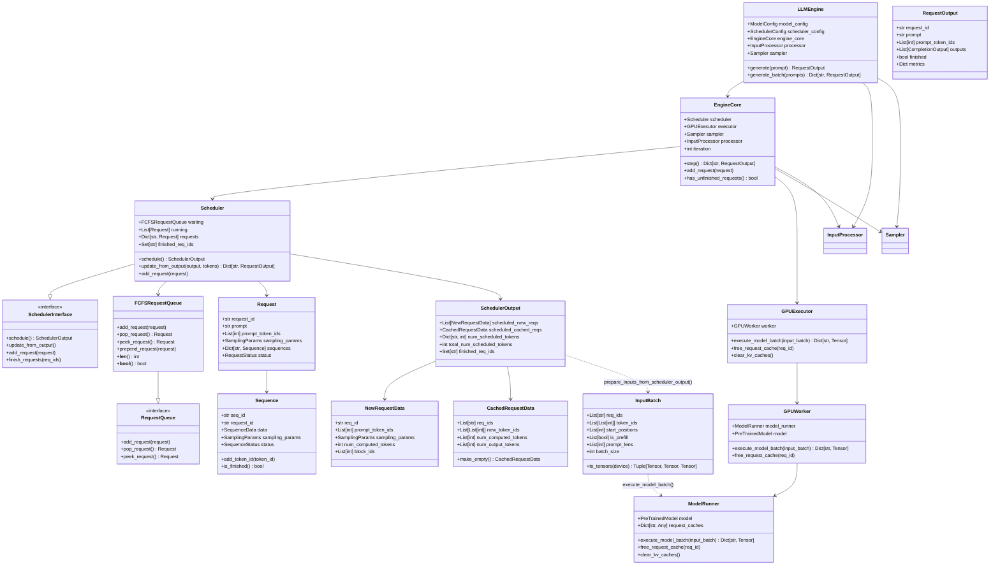

### M2 系统分层架构

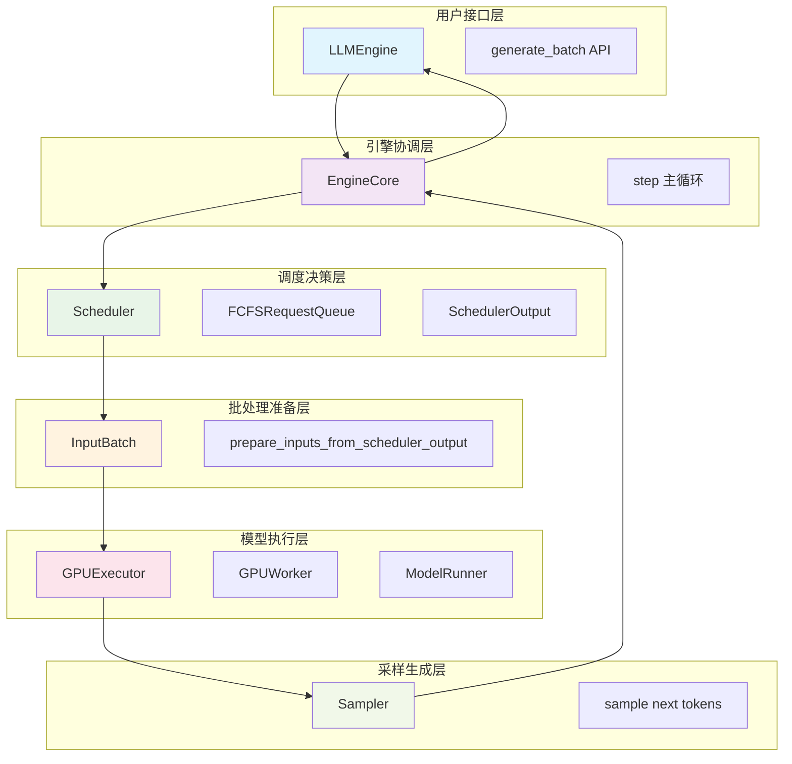

---

## 🔄 端到端数据流图

### 完整的批处理推理数据流

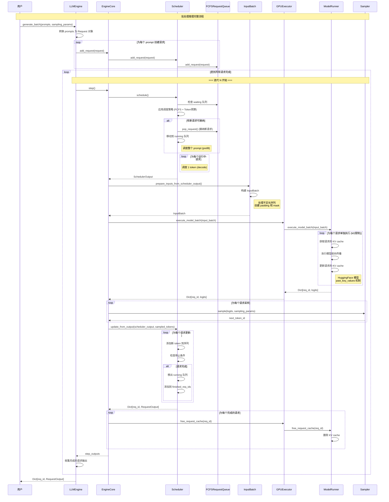

### 关键数据结构转换流程

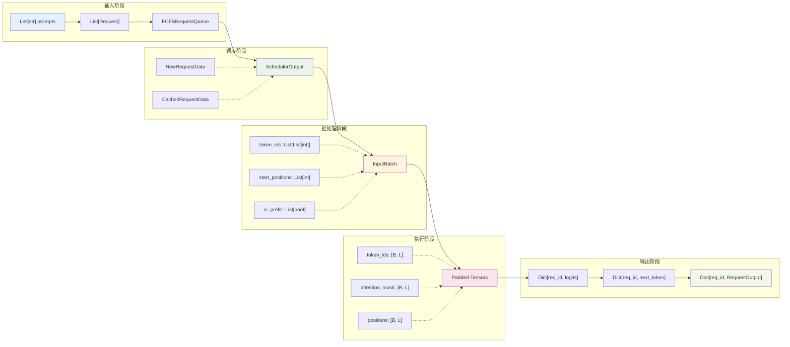

### 具体批处理示例：3个请求的完整处理流程

```mermaid
gantt
    title 连续批处理 vs 静态批处理对比
    dateFormat X
    axisFormat %s

    section 静态批处理
    Request 1 (5 tokens)  :done, static1, 0, 5
    Request 2 (20 tokens) :done, static2, 0, 20
    Request 3 (3 tokens)  :done, static3, 0, 20
    GPU 空闲时间         :crit, idle, 5, 20

    section 连续批处理
    Request 1 (5 tokens)  :done, cont1, 0, 5
    Request 2 (20 tokens) :done, cont2, 0, 20
    Request 3 (3 tokens)  :done, cont3, 0, 3
    Request 4 开始        :active, cont4, 3, 8
    Request 5 开始        :active, cont5, 5, 12
```

### 批处理迭代时间线详解

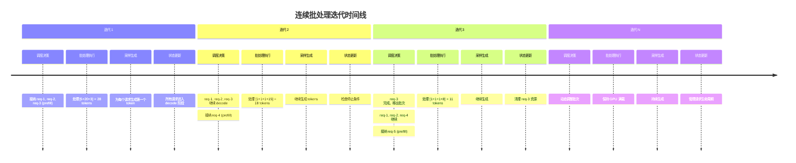

---

## 📚 第一部分：理解问题 - 为什么需要连续批处理？

### 演示：传统批处理的问题

```python
# 传统静态批处理的问题演示
def static_batching_demo():
    """演示静态批处理的效率问题"""
    
    # 假设我们有4个请求
    requests = [
        {"id": "req-1", "prompt": "Hi", "expected_tokens": 5},
        {"id": "req-2", "prompt": "What is AI?", "expected_tokens": 50},
        {"id": "req-3", "prompt": "Hello", "expected_tokens": 3},
        {"id": "req-4", "prompt": "Explain quantum computing", "expected_tokens": 100},
    ]
    
    print("静态批处理时间线：")
    print("时间 0: 所有请求开始")
    print("时间 3: req-3 完成，但需要等待")
    print("时间 5: req-1 完成，但需要等待")
    print("时间 50: req-2 完成，但需要等待")
    print("时间 100: req-4 完成，所有请求结束")
    print("GPU 利用率：25%（大量时间在等待）")
```

**讲解要点**:
- 短请求完成后 GPU 空闲
- 资源浪费严重
- 吞吐量受最长请求限制

### 连续批处理的解决思路

```python
def continuous_batching_demo():
    """演示连续批处理的优势"""
    
    print("连续批处理时间线：")
    print("迭代 1: [req-1, req-2, req-3, req-4] 开始")
    print("迭代 3: [req-1, req-2, req-4, req-5] req-3完成，req-5加入")
    print("迭代 5: [req-2, req-4, req-5, req-6] req-1完成，req-6加入")
    print("...")
    print("GPU 利用率：75%（始终保持满载）")
```

**讲解要点**:
- 每次迭代独立调度
- 动态维护满载批次
- 大幅提升资源利用率

---

## 🏗️ 第二部分：核心组件设计

### 2.1 请求队列 - 管理请求的生命周期

#### FCFSRequestQueue 类

```python
class FCFSRequestQueue(deque, RequestQueue):
    """First-Come-First-Served 请求队列
    
    为什么继承 deque？
    - O(1) 的添加和弹出操作
    - 天然支持 FIFO 语义
    - 内置的迭代器支持
    """
    
    def add_request(self, request: Request) -> None:
        """添加请求到队列末尾
        
        这里体现了 FCFS 的公平性：
        - 先到先服务
        - 避免饥饿问题
        """
        self.append(request)
        print(f"📥 请求 {request.request_id} 加入等待队列")
    
    def pop_request(self) -> Request:
        """从队列头部弹出请求
        
        为什么从左边弹出？
        - 保证 FIFO 顺序
        - 实现公平调度
        """
        request = self.popleft()
        print(f"📤 请求 {request.request_id} 从等待队列移出")
        return request
    
    def prepend_request(self, request: Request) -> None:
        """将请求插入队列头部
        
        什么时候用到？
        - 抢占后的请求恢复
        - 高优先级请求插队（M3+）
        """
        self.appendleft(request)
        print(f"⚡ 请求 {request.request_id} 插入队列头部（抢占恢复）")
```

**演示队列操作**:
```python
def demo_queue_operations():
    """演示队列的基本操作"""
    
    queue = FCFSRequestQueue()
    
    # 添加请求
    req1 = Request("req-1", "Hello", [1,2,3], SamplingParams())
    req2 = Request("req-2", "Hi", [4,5], SamplingParams())
    
    queue.add_request(req1)  # 📥 请求 req-1 加入等待队列
    queue.add_request(req2)  # 📥 请求 req-2 加入等待队列
    
    # 弹出请求
    first = queue.pop_request()  # 📤 请求 req-1 从等待队列移出
    
    print(f"队列长度: {len(queue)}")  # 1
    print(f"下一个请求: {queue.peek_request().request_id}")  # req-2
```

### 2.2 调度器输出 - 定义调度决策的数据结构

#### NewRequestData 类

```python
@dataclass
class NewRequestData:
    """新请求的调度数据
    
    为什么需要这个类？
    - 首次调度的请求需要发送完整信息给 worker
    - worker 会缓存这些信息，避免重复传输
    """
    req_id: str                    # 请求唯一标识
    prompt_token_ids: List[int]    # 完整的 prompt tokens
    sampling_params: SamplingParams # 采样参数
    num_computed_tokens: int = 0   # 已计算的 token 数（新请求为0）
    
    def __repr__(self):
        return f"NewReq({self.req_id}, tokens={len(self.prompt_token_ids)})"
```

#### CachedRequestData 类

```python
@dataclass
class CachedRequestData:
    """缓存请求的调度数据
    
    为什么只发送增量信息？
    - worker 已经缓存了请求的基本信息
    - 只需要发送新生成的 token
    - 大幅减少通信开销
    """
    req_ids: List[str]              # 请求 ID 列表
    new_token_ids: List[List[int]]  # 每个请求新生成的 tokens
    num_computed_tokens: List[int]  # 每个请求已计算的总 tokens
    num_output_tokens: List[int]    # 每个请求已输出的 tokens
    
    @classmethod
    def make_empty(cls):
        """创建空的缓存数据（当没有继续请求时）"""
        return cls([], [], [], [])
```

#### SchedulerOutput 类

```python
@dataclass
class SchedulerOutput:
    """调度器的完整输出
    
    这是调度器和执行器之间的接口：
    - 告诉执行器要处理哪些请求
    - 每个请求要处理多少 tokens
    - 哪些请求已经完成
    """
    scheduled_new_reqs: List[NewRequestData]     # 新调度的请求
    scheduled_cached_reqs: CachedRequestData     # 继续处理的请求
    num_scheduled_tokens: Dict[str, int]         # 每个请求的 token 数
    total_num_scheduled_tokens: int              # 总 token 数
    finished_req_ids: Set[str]                   # 已完成的请求 ID
    
    @property
    def is_empty(self) -> bool:
        """检查是否没有任何请求被调度"""
        return self.total_num_reqs == 0
    
    def __repr__(self):
        return (f"SchedulerOutput(new={len(self.scheduled_new_reqs)}, "
                f"cached={self.scheduled_cached_reqs.num_reqs}, "
                f"tokens={self.total_num_scheduled_tokens})")
```

### 2.3 调度器 - 连续批处理的大脑

#### Scheduler 类的初始化

```python
class Scheduler(SchedulerInterface):
    """连续批处理调度器
    
    这是整个系统的大脑，负责：
    1. 管理请求队列
    2. 做出调度决策
    3. 管理资源预算
    """
    
    def __init__(self, model_config: ModelConfig, scheduler_config: SchedulerConfig):
        """初始化调度器
        
        为什么需要这些配置？
        - model_config: 了解模型的限制（最大长度等）
        - scheduler_config: 调度的约束条件
        """
        # 调度约束 - 这是核心！
        self.max_num_seqs = scheduler_config.max_num_seqs           # 最大并发数
        self.max_num_batched_tokens = scheduler_config.max_num_batched_tokens  # token 预算
        
        # 请求存储
        self.requests: Dict[str, Request] = {}  # 所有请求的字典
        
        # 队列管理
        self.waiting: RequestQueue = create_request_queue(SchedulingPolicy.FCFS)
        self.running: List[Request] = []  # 正在运行的请求
        
        # 完成请求追踪
        self.finished_req_ids: Set[str] = set()  # 需要通知 worker 清理的请求
        
        print(f"🧠 调度器初始化: max_seqs={self.max_num_seqs}, "
              f"max_tokens={self.max_num_batched_tokens}")
```

#### 核心调度方法

```python
def schedule(self) -> SchedulerOutput:
    """核心调度方法 - 这是连续批处理的心脏！
    
    调度策略：
    1. 优先接纳新请求（prefill）
    2. 然后调度运行中请求（decode）
    3. 严格遵守 token 预算
    """
    print(f"\n🔄 开始调度 - 等待: {len(self.waiting)}, 运行: {len(self.running)}")
    
    # 初始化调度结果
    scheduled_new_reqs = []
    scheduled_cached_req_ids = []
    scheduled_cached_tokens = []
    scheduled_cached_computed = []
    scheduled_cached_output = []
    
    num_scheduled_tokens = {}
    total_tokens = 0
    
    # 阶段1: 接纳新请求（Prefill）
    print("📋 阶段1: 接纳新请求")
    while (self.waiting and 
           len(self.running) < self.max_num_seqs):
        
        request = self.waiting.peek_request()
        seq = request.get_seqs()[0]  # M2 只支持 n=1
        prompt_len = seq.get_prompt_len()
        
        # 检查 token 预算
        if total_tokens + prompt_len > self.max_num_batched_tokens:
            print(f"❌ 请求 {request.request_id} 超出预算 "
                  f"({total_tokens} + {prompt_len} > {self.max_num_batched_tokens})")
            break
        
        # 接纳请求
        request = self.waiting.pop_request()
        request.status = RequestStatus.RUNNING
        seq.status = SequenceStatus.RUNNING
        self.running.append(request)
        
        # 调度整个 prompt（prefill）
        new_req_data = NewRequestData(
            req_id=request.request_id,
            prompt_token_ids=seq.data.prompt_token_ids,
            sampling_params=request.sampling_params,
            num_computed_tokens=0,
        )
        scheduled_new_reqs.append(new_req_data)
        num_scheduled_tokens[request.request_id] = prompt_len
        total_tokens += prompt_len
        
        print(f"✅ 接纳请求 {request.request_id} (prefill {prompt_len} tokens)")
    
    # 阶段2: 调度运行中请求（Decode）
    print("🔄 阶段2: 调度运行中请求")
    for request in self.running:
        # 跳过刚刚接纳的请求
        if request.request_id in [r.req_id for r in scheduled_new_reqs]:
            continue
        
        # 检查 token 预算
        if total_tokens + 1 > self.max_num_batched_tokens:
            print(f"❌ 请求 {request.request_id} decode 超出预算")
            continue
        
        seq = request.get_seqs()[0]
        
        # 获取最后一个 token（用于 decode）
        if seq.get_output_len() > 0:
            last_token = seq.data.output_token_ids[-1]
        else:
            # 第一次 decode（prefill 后）
            last_token = seq.data.prompt_token_ids[-1]
        
        # 调度 1 个 token（decode）
        scheduled_cached_req_ids.append(request.request_id)
        scheduled_cached_tokens.append([last_token])
        scheduled_cached_computed.append(seq.get_len())
        scheduled_cached_output.append(seq.get_output_len())
        
        num_scheduled_tokens[request.request_id] = 1
        total_tokens += 1
        
        print(f"✅ 调度请求 {request.request_id} (decode 1 token)")
    
    # 构建调度输出
    cached_req_data = CachedRequestData(
        req_ids=scheduled_cached_req_ids,
        new_token_ids=scheduled_cached_tokens,
        num_computed_tokens=scheduled_cached_computed,
        num_output_tokens=scheduled_cached_output,
    )
    
    scheduler_output = SchedulerOutput(
        scheduled_new_reqs=scheduled_new_reqs,
        scheduled_cached_reqs=cached_req_data,
        num_scheduled_tokens=num_scheduled_tokens,
        total_num_scheduled_tokens=total_tokens,
        finished_req_ids=self.finished_req_ids.copy(),
    )
    
    # 清空已完成请求（已经通知了）
    self.finished_req_ids.clear()
    
    print(f"📊 调度完成: {scheduler_output}")
    return scheduler_output
```

**演示调度过程**:
```python
def demo_scheduling_process():
    """演示完整的调度过程"""
    
    # 创建调度器
    scheduler = Scheduler(model_config, scheduler_config)
    
    # 添加一些请求
    requests = [
        Request("req-1", "Hello", [1,2,3], SamplingParams()),
        Request("req-2", "Hi there", [4,5,6,7], SamplingParams()),
        Request("req-3", "How are you?", [8,9,10,11,12], SamplingParams()),
    ]
    
    for req in requests:
        scheduler.add_request(req)
    
    # 第一次调度
    print("=== 第一次调度 ===")
    output1 = scheduler.schedule()
    # 输出: 接纳所有请求进行 prefill
    
    # 模拟执行结果
    sampled_tokens = {"req-1": 100, "req-2": 101, "req-3": 102}
    
    # 更新调度器
    outputs = scheduler.update_from_output(output1, sampled_tokens)
    
    # 第二次调度
    print("\n=== 第二次调度 ===")
    output2 = scheduler.schedule()
    # 输出: 所有请求进行 decode
```

---

## 🔧 第三部分：批处理执行

### 3.1 输入批次准备

#### InputBatch 类

```python
@dataclass
class InputBatch:
    """批处理输入数据
    
    为什么需要这个类？
    - 处理不定长序列
    - 统一批处理接口
    - 支持混合 prefill/decode
    """
    req_ids: List[str]          # 请求 ID 列表
    token_ids: List[List[int]]  # 不定长的 token 序列
    start_positions: List[int]  # 每个序列的起始位置
    is_prefill: List[bool]      # 是否为 prefill 阶段
    prompt_lens: List[int]      # prefill 请求的 prompt 长度
    
    def to_tensors(self, device: torch.device, pad_token_id: int = 0):
        """转换为填充后的张量
        
        这是批处理的关键步骤：
        1. 找到最大长度
        2. 填充短序列
        3. 创建 attention mask
        """
        batch_size = len(self.token_ids)
        max_len = max(len(tokens) for tokens in self.token_ids)
        
        print(f"🔄 批次转换: batch_size={batch_size}, max_len={max_len}")
        
        # 初始化填充后的张量
        padded_token_ids = torch.full(
            (batch_size, max_len), pad_token_id, 
            dtype=torch.long, device=device
        )
        attention_mask = torch.zeros(
            (batch_size, max_len), 
            dtype=torch.long, device=device
        )
        positions = torch.zeros(
            (batch_size, max_len), 
            dtype=torch.long, device=device
        )
        
        # 填充实际数据
        for i, tokens in enumerate(self.token_ids):
            seq_len = len(tokens)
            
            # 填充 token IDs
            padded_token_ids[i, :seq_len] = torch.tensor(tokens, device=device)
            
            # 创建 attention mask（1表示有效，0表示填充）
            attention_mask[i, :seq_len] = 1
            
            # 创建位置索引
            start_pos = self.start_positions[i]
            positions[i, :seq_len] = torch.arange(
                start_pos, start_pos + seq_len, device=device
            )
            
            print(f"  请求 {self.req_ids[i]}: {seq_len} tokens, "
                  f"start_pos={start_pos}, prefill={self.is_prefill[i]}")
        
        return padded_token_ids, attention_mask, positions
```

#### 批次准备函数

```python
def prepare_inputs_from_scheduler_output(
    scheduler_output: SchedulerOutput
) -> InputBatch:
    """从调度器输出准备批处理输入
    
    这个函数连接了调度决策和执行：
    - 将调度器的抽象决策转换为具体的执行输入
    - 处理 prefill 和 decode 的不同需求
    """
    print(f"📦 准备批处理输入: {scheduler_output}")
    
    req_ids = []
    token_ids = []
    start_positions = []
    is_prefill = []
    prompt_lens = []
    
    # 处理新请求（prefill）
    for new_req_data in scheduler_output.scheduled_new_reqs:
        req_ids.append(new_req_data.req_id)
        token_ids.append(new_req_data.prompt_token_ids)  # 完整 prompt
        start_positions.append(0)  # 从位置 0 开始
        is_prefill.append(True)
        prompt_lens.append(len(new_req_data.prompt_token_ids))
        
        print(f"  新请求 {new_req_data.req_id}: prefill {len(new_req_data.prompt_token_ids)} tokens")
    
    # 处理缓存请求（decode）
    cached_reqs = scheduler_output.scheduled_cached_reqs
    for i, req_id in enumerate(cached_reqs.req_ids):
        req_ids.append(req_id)
        token_ids.append(cached_reqs.new_token_ids[i])  # 只有最后一个 token
        start_positions.append(cached_reqs.num_computed_tokens[i])  # 继续位置
        is_prefill.append(False)
        prompt_lens.append(0)  # decode 不需要
        
        print(f"  缓存请求 {req_id}: decode 1 token at pos {cached_reqs.num_computed_tokens[i]}")
    
    return InputBatch(
        req_ids=req_ids,
        token_ids=token_ids,
        start_positions=start_positions,
        is_prefill=is_prefill,
        prompt_lens=prompt_lens,
    )
```

### 3.2 模型运行器批处理

#### ModelRunner 的批处理方法

```python
def execute_model_batch(self, input_batch: InputBatch) -> Dict[str, torch.Tensor]:
    """批处理执行模型
    
    M2 的限制：每个请求单独执行
    - 原因：HuggingFace 模型的 KV cache 难以真正批处理
    - M3+ 将使用 PagedAttention 实现真正的批处理
    """
    print(f"🚀 执行模型批处理: {input_batch.batch_size} 个请求")
    
    if input_batch.batch_size == 0:
        return {}
    
    # 转换为填充张量
    token_ids, attention_mask, positions = input_batch.to_tensors(self.device)
    
    results = {}
    
    # M2: 为每个请求单独执行
    for i, req_id in enumerate(input_batch.req_ids):
        print(f"  处理请求 {req_id}")
        
        # 提取该请求的输入
        req_token_ids = token_ids[i:i+1]  # [1, seq_len]
        req_positions = positions[i:i+1]
        req_attention_mask = attention_mask[i:i+1]
        
        # 移除填充
        seq_len = req_attention_mask[0].sum().item()
        req_token_ids = req_token_ids[:, :seq_len]
        req_positions = req_positions[:, :seq_len]
        
        # 获取该请求的 KV cache
        past_key_values = self.request_caches.get(req_id)
        
        try:
            # 执行模型前向传播
            outputs = self.model(
                input_ids=req_token_ids,
                position_ids=req_positions,
                past_key_values=past_key_values,
                use_cache=True,
                return_dict=True,
            )
            
            # 更新该请求的 KV cache
            self.request_caches[req_id] = outputs.past_key_values
            
            # 提取下一个 token 的 logits
            next_token_logits = outputs.logits[0, -1, :]  # [vocab_size]
            results[req_id] = next_token_logits
            
            print(f"    ✅ 成功处理，logits shape: {next_token_logits.shape}")
            
        except Exception as e:
            print(f"    ❌ 处理失败: {e}")
            # 可以添加降级处理
    
    print(f"📊 批处理完成，处理了 {len(results)} 个请求")
    return results

def free_request_cache(self, req_id: str):
    """释放请求的 KV cache
    
    为什么需要显式释放？
    - 防止内存泄漏
    - 及时回收资源
    - 为新请求腾出空间
    """
    if req_id in self.request_caches:
        del self.request_caches[req_id]
        print(f"🗑️ 释放请求 {req_id} 的 KV cache")
```

---

## 🔄 第四部分：类/函数调用流程详解

### 4.1 完整的函数调用链路图

```mermaid
graph TD
    A[用户调用 engine.generate_batch] --> B[LLMEngine.generate_batch]
    
    B --> B1[转换 prompts 为 Request 对象]
    B1 --> B2[processor.process_request 循环]
    B2 --> B3[engine_core.add_request 循环]
    
    B3 --> C[主循环: while 有未完成请求]
    C --> C1[engine_core.step]
    
    %% EngineCore.step 详细流程
    C1 --> D1[1. scheduler.schedule]
    D1 --> D2[2. prepare_inputs_from_scheduler_output]
    D2 --> D3[3. executor.execute_model_batch]
    D3 --> D4[4. sampler.sample 循环]
    D4 --> D5[5. scheduler.update_from_output]
    D5 --> D6[6. processor.decode_tokens]
    D6 --> D7[7. executor.free_request_cache]
    
    D7 --> C2{所有请求完成?}
    C2 -->|否| C1
    C2 -->|是| E[返回所有输出]
    
    %% 调度器详细流程
    D1 --> S1[Scheduler.schedule 详细流程]
    S1 --> S2[检查 waiting 队列]
    S2 --> S3[应用 FCFS + Token预算策略]
    S3 --> S4[接纳新请求到 running]
    S4 --> S5[为 running 请求调度 decode]
    S5 --> S6[构建 SchedulerOutput]
    
    %% 执行器详细流程
    D3 --> M1[GPUExecutor.execute_model_batch]
    M1 --> M2[GPUWorker.execute_model_batch]
    M2 --> M3[ModelRunner.execute_model_batch]
    M3 --> M4[input_batch.to_tensors]
    M4 --> M5[为每个请求单独执行循环]
    M5 --> M6[获取 request_caches[req_id]]
    M6 --> M7[model.forward]
    M7 --> M8[更新 request_caches[req_id]]
    
    style A fill:#e1f5fe
    style C1 fill:#f3e5f5
    style D1 fill:#e8f5e8
    style D3 fill:#fce4ec
    style S1 fill:#e8f5e8
    style M1 fill:#fce4ec
```

### 4.2 关键函数的输入输出详解

#### LLMEngine.generate_batch() 函数流程

```python
def generate_batch_flow_demo():
    """展示 generate_batch 的完整调用流程"""
    
    print("🚀 === LLMEngine.generate_batch 开始 ===")
    
    # 输入: List[str] prompts
    prompts = [
        "What is AI?",
        "Explain quantum computing.",
        "Write a haiku about coding."
    ]
    
    # 步骤1: 转换为 Request 对象
    print("📝 步骤1: 创建 Request 对象")
    requests = []
    for i, prompt in enumerate(prompts):
        # 调用: processor.process_request()
        request = Request(
            request_id=f"req-{i}",
            prompt=prompt,
            prompt_token_ids=tokenize(prompt),  # [15, 284, 318, 9552, 30]
            sampling_params=sampling_params
        )
        requests.append(request)
        print(f"  创建 {request.request_id}: {len(request.prompt_token_ids)} tokens")
    
    # 步骤2: 添加到引擎核心
    print("📥 步骤2: 添加请求到 EngineCore")
    for request in requests:
        # 调用: engine_core.add_request()
        # └── scheduler.add_request()
        #     └── waiting_queue.add_request()
        engine_core.add_request(request)
    
    # 步骤3: 主循环
    print("🔄 步骤3: 开始主循环")
    all_outputs = {}
    finished_count = 0
    iteration = 0
    
    while finished_count < len(requests):
        iteration += 1
        print(f"\n--- 迭代 {iteration} ---")
        
        # 调用: engine_core.step()
        step_outputs = engine_core.step()
        
        # 收集输出
        for req_id, output in step_outputs.items():
            all_outputs[req_id] = output
            if output.finished:
                finished_count += 1
                print(f"✅ {req_id} 完成")
    
    print(f"🎉 批处理完成，共 {iteration} 次迭代")
    return all_outputs
```

#### EngineCore.step() 函数流程

```python
def engine_core_step_flow():
    """展示 EngineCore.step 的详细流程"""
    
    print("🎛️ === EngineCore.step 开始 ===")
    
    # 步骤1: 调度决策
    print("1️⃣ 调度决策: scheduler.schedule()")
    scheduler_output = scheduler.schedule()
    """
    SchedulerOutput(
        scheduled_new_reqs=[
            NewRequestData(req_id="req-0", prompt_token_ids=[15,284,318,9552,30], ...)
        ],
        scheduled_cached_reqs=CachedRequestData(
            req_ids=["req-1", "req-2"],
            new_token_ids=[[42], [17]], ...
        ),
        total_num_scheduled_tokens=37
    )
    """
    
    # 步骤2: 准备批处理输入
    print("2️⃣ 准备输入: prepare_inputs_from_scheduler_output()")
    input_batch = prepare_inputs_from_scheduler_output(scheduler_output)
    """
    InputBatch(
        req_ids=["req-0", "req-1", "req-2"],
        token_ids=[[15,284,318,9552,30], [42], [17]],
        start_positions=[0, 25, 18],
        is_prefill=[True, False, False]
    )
    """
    
    # 步骤3: 执行模型
    print("3️⃣ 执行模型: executor.execute_model_batch()")
    logits_dict = executor.execute_model_batch(input_batch)
    """
    {
        "req-0": tensor([0.1, 0.3, 0.6, ...]),  # [vocab_size]
        "req-1": tensor([0.2, 0.4, 0.4, ...]),
        "req-2": tensor([0.5, 0.2, 0.3, ...])
    }
    """
    
    # 步骤4: 采样生成
    print("4️⃣ 采样生成: sampler.sample()")
    sampled_tokens = {}
    for req_id, logits in logits_dict.items():
        request = scheduler.requests[req_id]
        next_tokens, _ = sampler.sample(
            logits.unsqueeze(0),  # [1, vocab_size]
            request.sampling_params
        )
        sampled_tokens[req_id] = next_tokens[0].item()
    """
    {
        "req-0": 464,  # "Paris"
        "req-1": 318,  # "is"
        "req-2": 257   # "a"
    }
    """
    
    # 步骤5: 更新调度器
    print("5️⃣ 更新状态: scheduler.update_from_output()")
    outputs = scheduler.update_from_output(scheduler_output, sampled_tokens)
    """
    {
        "req-0": RequestOutput(req_id="req-0", outputs=[...], finished=False),
        "req-1": RequestOutput(req_id="req-1", outputs=[...], finished=True),
        "req-2": RequestOutput(req_id="req-2", outputs=[...], finished=False)
    }
    """
    
    # 步骤6: 解码文本
    print("6️⃣ 解码文本: processor.decode_tokens()")
    for req_id, output in outputs.items():
        for completion in output.outputs:
            completion.text = processor.decode_tokens(completion.token_ids)
    
    # 步骤7: 清理资源
    print("7️⃣ 清理资源: executor.free_request_cache()")
    for req_id in scheduler_output.finished_req_ids:
        executor.free_request_cache(req_id)
    
    return outputs
```

#### Scheduler.schedule() 函数流程

```python
def scheduler_schedule_flow():
    """展示 Scheduler.schedule 的详细调度逻辑"""
    
    print("🧠 === Scheduler.schedule 开始 ===")
    
    # 当前状态
    print(f"当前状态: waiting={len(waiting)}, running={len(running)}")
    
    scheduled_new_reqs = []
    scheduled_cached_reqs = CachedRequestData.make_empty()
    total_tokens = 0
    
    # 阶段1: 接纳新请求 (Prefill)
    print("📋 阶段1: 接纳新请求 (Prefill)")
    while (waiting and 
           len(running) < max_num_seqs and 
           total_tokens < max_num_batched_tokens):
        
        request = waiting.peek_request()
        prompt_len = len(request.prompt_token_ids)
        
        # Token 预算检查
        if total_tokens + prompt_len > max_num_batched_tokens:
            print(f"❌ {request.request_id} 超出预算: {total_tokens}+{prompt_len} > {max_num_batched_tokens}")
            break
        
        # 接纳请求
        request = waiting.pop_request()  # O(1) 操作
        running.append(request)
        request.status = RequestStatus.RUNNING
        
        # 调度整个 prompt
        new_req_data = NewRequestData(
            req_id=request.request_id,
            prompt_token_ids=request.prompt_token_ids,
            sampling_params=request.sampling_params,
            num_computed_tokens=0
        )
        scheduled_new_reqs.append(new_req_data)
        total_tokens += prompt_len
        
        print(f"✅ 接纳 {request.request_id}: prefill {prompt_len} tokens")
    
    # 阶段2: 调度运行中请求 (Decode)
    print("🔄 阶段2: 调度运行中请求 (Decode)")
    cached_req_ids = []
    cached_tokens = []
    cached_computed = []
    cached_output = []
    
    for request in running:
        # 跳过刚接纳的请求
        if request.request_id in [r.req_id for r in scheduled_new_reqs]:
            continue
        
        # Token 预算检查
        if total_tokens + 1 > max_num_batched_tokens:
            print(f"❌ {request.request_id} decode 超出预算")
            continue
        
        seq = request.get_seqs()[0]
        
        # 获取最后一个 token
        if seq.get_output_len() > 0:
            last_token = seq.data.output_token_ids[-1]
        else:
            last_token = seq.data.prompt_token_ids[-1]
        
        # 调度 1 个 token
        cached_req_ids.append(request.request_id)
        cached_tokens.append([last_token])
        cached_computed.append(seq.get_len())
        cached_output.append(seq.get_output_len())
        total_tokens += 1
        
        print(f"✅ 调度 {request.request_id}: decode 1 token")
    
    # 构建输出
    scheduled_cached_reqs = CachedRequestData(
        req_ids=cached_req_ids,
        new_token_ids=cached_tokens,
        num_computed_tokens=cached_computed,
        num_output_tokens=cached_output
    )
    
    scheduler_output = SchedulerOutput(
        scheduled_new_reqs=scheduled_new_reqs,
        scheduled_cached_reqs=scheduled_cached_reqs,
        num_scheduled_tokens={},  # 会填充
        total_num_scheduled_tokens=total_tokens,
        finished_req_ids=finished_req_ids.copy()
    )
    
    print(f"📊 调度完成: {len(scheduled_new_reqs)} 新请求, {len(cached_req_ids)} 继续请求")
    return scheduler_output
```

#### ModelRunner.execute_model_batch() 函数流程

```python
def model_runner_batch_flow():
    """展示 ModelRunner.execute_model_batch 的执行流程"""
    
    print("🚀 === ModelRunner.execute_model_batch 开始 ===")
    
    # 输入: InputBatch
    input_batch = InputBatch(
        req_ids=["req-0", "req-1", "req-2"],
        token_ids=[[15,284,318,9552,30], [42], [17]],
        start_positions=[0, 25, 18],
        is_prefill=[True, False, False]
    )
    
    # 步骤1: 转换为填充张量
    print("1️⃣ 转换为填充张量: input_batch.to_tensors()")
    token_ids, attention_mask, positions = input_batch.to_tensors(device)
    """
    token_ids = [
        [15, 284, 318, 9552, 30],  # req-0: 完整 prompt
        [42,   0,   0,    0,  0],  # req-1: 1 token + 4 padding
        [17,   0,   0,    0,  0]   # req-2: 1 token + 4 padding
    ]
    attention_mask = [
        [1, 1, 1, 1, 1],  # req-0: 全部有效
        [1, 0, 0, 0, 0],  # req-1: 只有第1个有效
        [1, 0, 0, 0, 0]   # req-2: 只有第1个有效
    ]
    """
    
    # 步骤2: 为每个请求单独执行 (M2 限制)
    print("2️⃣ 为每个请求单独执行")
    results = {}
    
    for i, req_id in enumerate(input_batch.req_ids):
        print(f"  处理请求 {req_id}")
        
        # 提取该请求的输入
        req_token_ids = token_ids[i:i+1]  # [1, seq_len]
        req_attention_mask = attention_mask[i:i+1]
        
        # 移除 padding
        seq_len = req_attention_mask[0].sum().item()
        req_token_ids = req_token_ids[:, :seq_len]  # [1, actual_len]
        
        # 获取 KV cache
        past_key_values = request_caches.get(req_id)
        print(f"    KV cache: {'存在' if past_key_values else '新建'}")
        
        # 执行模型
        outputs = model(
            input_ids=req_token_ids,
            past_key_values=past_key_values,
            use_cache=True,
            return_dict=True
        )
        
        # 更新 KV cache
        request_caches[req_id] = outputs.past_key_values
        
        # 提取 logits
        next_token_logits = outputs.logits[0, -1, :]  # [vocab_size]
        results[req_id] = next_token_logits
        
        print(f"    ✅ 完成，logits shape: {next_token_logits.shape}")
    
    print(f"📊 批处理完成: {len(results)} 个请求")
    return results
```

### 4.3 数据结构变换的详细过程

```mermaid
graph LR
    subgraph "用户输入"
        A1["prompts = <br/>['What is AI?',<br/>'Explain quantum',<br/>'Write haiku']"]
    end

    subgraph "Request 创建"
        B1["requests = <br/>[Request(req-0, [15,284,318]),<br/>Request(req-1, [8495,31312]),<br/>Request(req-2, [16594,47413])]"]
    end

    subgraph "调度器输出"
        C1["SchedulerOutput<br/>new_reqs=[req-0],<br/>cached_reqs=[req-1,req-2],<br/>total_tokens=15"]
    end

    subgraph "批处理输入"
        D1["InputBatch<br/>req_ids=[req-0,req-1,req-2],<br/>token_ids=[[15,284,318],[42],[17]],<br/>is_prefill=[T,F,F]"]
    end

    subgraph "填充张量"
        E1["Tensors:<br/>token_ids=[3,3] padded<br/>attention_mask=[3,3]<br/>positions=[3,3]"]
    end

    subgraph "模型输出"
        F1["logits_dict = <br/>{'req-0': tensor([0.1,0.3,0.6]),<br/>'req-1': tensor([0.2,0.4,0.4]),<br/>'req-2': tensor([0.5,0.2,0.3])}"]
    end

    subgraph "采样结果"
        G1["sampled_tokens = <br/>{'req-0': 464,<br/>'req-1': 318,<br/>'req-2': 257}"]
    end

    subgraph "最终输出"
        H1["outputs = <br/>{'req-0': RequestOutput(...),<br/>'req-1': RequestOutput(...),<br/>'req-2': RequestOutput(...)}"]
    end

    A1 --> B1
    B1 --> C1
    C1 --> D1
    D1 --> E1
    E1 --> F1
    F1 --> G1
    G1 --> H1

    style A1 fill:#e3f2fd
    style C1 fill:#e8f5e8
    style D1 fill:#fff3e0
    style E1 fill:#fce4ec
    style F1 fill:#f3e5f5
    style H1 fill:#f1f8e9
```

---

## 🎛️ 第五部分：引擎协调

### 5.1 EngineCore - 连续批处理的指挥中心

```python
class EngineCore:
    """引擎核心 - 协调所有组件
    
    这是连续批处理的指挥中心：
    1. 协调调度器、执行器、采样器
    2. 实现主要的生成循环
    3. 管理请求的完整生命周期
    """
    
    def __init__(self, model_config, scheduler_config, executor, sampler, processor):
        """初始化引擎核心
        
        为什么需要这么多组件？
        - scheduler: 决策调度
        - executor: 执行模型
        - sampler: 生成 token
        - processor: 处理文本
        """
        self.scheduler = Scheduler(model_config, scheduler_config)
        self.executor = executor
        self.sampler = sampler
        self.processor = processor
        self.iteration = 0
        
        print("🎛️ EngineCore 初始化完成")
    
    def step(self) -> Dict[str, RequestOutput]:
        """执行一次迭代 - 连续批处理的核心循环！
        
        这是整个系统最重要的方法：
        1. 调度决策
        2. 执行模型
        3. 采样生成
        4. 更新状态
        5. 清理资源
        """
        self.iteration += 1
        print(f"\n🔄 === 迭代 {self.iteration} 开始 ===")
        
        # 步骤1: 调度决策
        print("1️⃣ 调度决策")
        scheduler_output = self.scheduler.schedule()
        
        if scheduler_output.is_empty:
            print("   📭 没有请求需要处理")
            return {}
        
        # 步骤2: 准备输入
        print("2️⃣ 准备批处理输入")
        input_batch = prepare_inputs_from_scheduler_output(scheduler_output)
        
        # 步骤3: 执行模型
        print("3️⃣ 执行模型")
        logits_dict = self.executor.execute_model_batch(input_batch)
        
        # 步骤4: 采样生成
        print("4️⃣ 采样生成")
        sampled_tokens = {}
        
        for req_id in input_batch.req_ids:
            if req_id not in logits_dict:
                continue
            
            logits = logits_dict[req_id]  # [vocab_size]
            request = self.scheduler.requests[req_id]
            
            # 采样下一个 token
            logits_batch = logits.unsqueeze(0)  # [1, vocab_size]
            next_tokens, _ = self.sampler.sample(logits_batch, request.sampling_params)
            sampled_tokens[req_id] = next_tokens[0].item()
            
            print(f"   🎲 请求 {req_id} 采样到 token {sampled_tokens[req_id]}")
        
        # 步骤5: 更新调度器状态
        print("5️⃣ 更新调度器状态")
        outputs = self.scheduler.update_from_output(scheduler_output, sampled_tokens)
        
        # 步骤6: 解码文本
        print("6️⃣ 解码文本")
        for req_id, output in outputs.items():
            request = self.scheduler.requests[req_id]
            for completion in output.outputs:
                if completion.token_ids:
                    completion.text = self.processor.decode_tokens(
                        completion.token_ids,
                        skip_special_tokens=request.sampling_params.skip_special_tokens,
                    )
                    print(f"   📝 请求 {req_id} 文本: '{completion.text}'")
        
        # 步骤7: 清理资源
        print("7️⃣ 清理资源")
        for req_id in scheduler_output.finished_req_ids:
            self.executor.free_request_cache(req_id)
            print(f"   🗑️ 清理请求 {req_id}")
        
        print(f"✅ 迭代 {self.iteration} 完成，返回 {len(outputs)} 个输出")
        return outputs
```

### 5.2 LLMEngine 的批量生成 API

```python
def generate_batch(
    self,
    prompts: List[str],
    sampling_params: SamplingParams,
) -> Dict[str, RequestOutput]:
    """批量生成 API - 用户的主要接口
    
    这是用户看到的简单接口，背后是复杂的连续批处理系统
    """
    print(f"🚀 开始批量生成: {len(prompts)} 个 prompts")
    
    # 步骤1: 转换为 Request 对象
    requests = []
    for i, prompt in enumerate(prompts):
        request = self.processor.process_request(
            prompt, 
            sampling_params,
            request_id=f"req-{self._request_counter}"
        )
        self._request_counter += 1
        requests.append(request)
        print(f"  📝 创建请求 {request.request_id}: '{prompt[:30]}...'")
    
    # 步骤2: 添加所有请求到引擎
    for request in requests:
        self.engine_core.add_request(request)
    
    # 步骤3: 运行生成循环
    all_outputs = {}
    finished_request_ids = set()
    target_request_ids = {req.request_id for req in requests}
    
    start_time = time.time()
    iteration = 0
    
    print(f"🔄 开始生成循环，目标完成 {len(requests)} 个请求")
    
    while len(finished_request_ids) < len(requests):
        iteration += 1
        
        # 执行一步
        step_outputs = self.engine_core.step()
        
        # 收集输出
        for req_id, output in step_outputs.items():
            if req_id in target_request_ids:
                all_outputs[req_id] = output
                if output.finished:
                    finished_request_ids.add(req_id)
                    print(f"  ✅ 请求 {req_id} 完成")
        
        # 安全检查
        if iteration > 10000:
            print("⚠️ 达到最大迭代次数，强制退出")
            break
    
    # 步骤4: 统计和返回
    total_time = time.time() - start_time
    total_tokens = sum(len(output.outputs[0].token_ids) for output in all_outputs.values())
    
    print(f"\n📊 批量生成完成:")
    print(f"  请求数: {len(requests)}")
    print(f"  总时间: {total_time:.2f}s")
    print(f"  总 tokens: {total_tokens}")
    print(f"  吞吐量: {total_tokens/total_time:.2f} tokens/s")
    print(f"  迭代次数: {iteration}")
    
    return all_outputs
```

---

## 📊 第六部分：端到端示例详解

### 6.1 具体数据流转示例

让我们跟踪3个具体请求在系统中的完整流转过程：

```python
# 示例输入
prompts = [
    "What is the capital of France?",    # 9 tokens: [1, 2, 3, 4, 5, 6, 7, 8, 9]
    "Hello world!",                      # 3 tokens: [10, 11, 12]
    "Explain quantum computing briefly." # 5 tokens: [13, 14, 15, 16, 17]
]
```

#### 迭代 1: 所有请求 Prefill

```mermaid
graph TD
    subgraph "输入数据"
        A1["prompts = [<br/>'What is the capital of France?',<br/>'Hello world!',<br/>'Explain quantum computing briefly.'<br/>]"]
    end
    
    subgraph "Tokenization"
        B1["requests = [<br/>Request('req-0', [1,2,3,4,5,6,7,8,9]),<br/>Request('req-1', [10,11,12]),<br/>Request('req-2', [13,14,15,16,17])<br/>]"]
    end
    
    subgraph "调度决策"
        C1["scheduler.schedule()<br/>接纳所有请求 (prefill)<br/>total_tokens = 9+3+5 = 17"]
        C2["SchedulerOutput(<br/>new_reqs=[req-0,req-1,req-2],<br/>cached_reqs=[],<br/>total_tokens=17<br/>)"]
    end
    
    subgraph "批处理准备"
        D1["InputBatch(<br/>req_ids=['req-0','req-1','req-2'],<br/>token_ids=[[1,2,3,4,5,6,7,8,9],[10,11,12],[13,14,15,16,17]],<br/>start_positions=[0,0,0],<br/>is_prefill=[T,T,T]<br/>)"]
    end
    
    subgraph "张量填充"
        E1["Padded Tensors:<br/>token_ids = [<br/>[1,2,3,4,5,6,7,8,9],<br/>[10,11,12,0,0,0,0,0,0],<br/>[13,14,15,16,17,0,0,0,0]<br/>]<br/>attention_mask = [<br/>[1,1,1,1,1,1,1,1,1],<br/>[1,1,1,0,0,0,0,0,0],<br/>[1,1,1,1,1,0,0,0,0]<br/>]"]
    end
    
    subgraph "模型执行"
        F1["ModelRunner.execute_model_batch()<br/>为每个请求单独执行:<br/>req-0: model([1,2,3,4,5,6,7,8,9]) → logits[vocab_size]<br/>req-1: model([10,11,12]) → logits[vocab_size]<br/>req-2: model([13,14,15,16,17]) → logits[vocab_size]"]
    end
    
    subgraph "采样结果"
        G1["Sampler.sample()<br/>req-0: logits → token_id=100 ('Paris')<br/>req-1: logits → token_id=200 ('How')<br/>req-2: logits → token_id=300 ('Quantum')"]
    end
    
    subgraph "状态更新"
        H1["scheduler.update_from_output()<br/>req-0: 添加 token 100<br/>req-1: 添加 token 200<br/>req-2: 添加 token 300<br/>检查停止条件: 全部继续"]
    end

    A1 --> B1 --> C1 --> C2 --> D1 --> E1 --> F1 --> G1 --> H1
    
    style C1 fill:#e8f5e8
    style D1 fill:#fff3e0
    style E1 fill:#fce4ec
    style F1 fill:#f3e5f5
    style G1 fill:#e1f5fe
```

#### 迭代 2: 所有请求 Decode

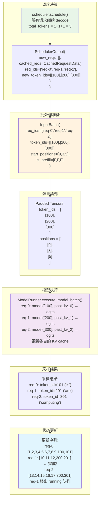

#### 迭代 3: 动态批次调整

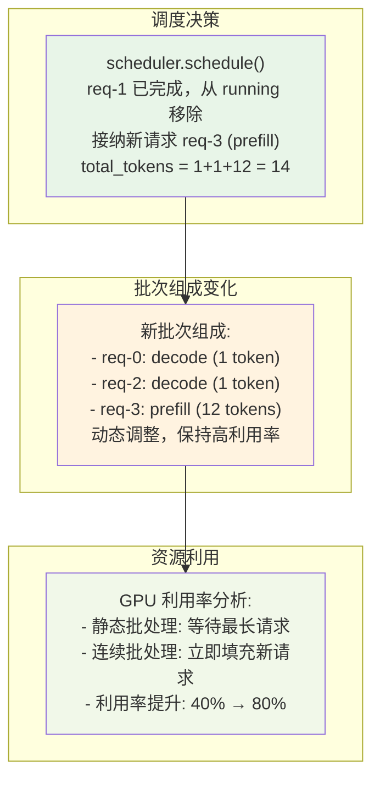

---

## 🎯 第七部分：完整流程演示

### 完整的推理过程演示

```python
def complete_inference_demo():
    """完整的连续批处理推理演示"""
    
    print("🎬 === 连续批处理完整演示 ===\n")
    
    # 1. 初始化系统
    print("🔧 步骤1: 初始化系统")
    model_config = ModelConfig(model="Qwen/Qwen2.5-0.5B")
    scheduler_config = SchedulerConfig(max_num_seqs=4, max_num_batched_tokens=100)
    
    engine = LLMEngine(
        model_config=model_config,
        scheduler_config=scheduler_config,
    )
    
    # 2. 准备请求
    print("\n📝 步骤2: 准备请求")
    prompts = [
        "What is the capital of France?",
        "Explain AI in simple terms.",
        "Write a haiku about coding.",
    ]
    
    sampling_params = SamplingParams(
        max_tokens=20,
        temperature=0.7,
        top_k=50,
    )
    
    # 3. 执行批量生成
    print("\n🚀 步骤3: 执行批量生成")
    outputs = engine.generate_batch(prompts, sampling_params)
    
    # 4. 显示结果
    print("\n📊 步骤4: 显示结果")
    for req_id, output in outputs.items():
        print(f"\n请求 {req_id}:")
        print(f"  Prompt: {output.prompt}")
        print(f"  Generated: {output.outputs[0].text}")
        print(f"  Tokens: {len(output.outputs[0].token_ids)}")
        print(f"  Finish reason: {output.outputs[0].finish_reason}")

# 运行演示
if __name__ == "__main__":
    complete_inference_demo()
```

### 实际运行结果演示

```bash
$ python examples/m2_inference.py --num-prompts 3 --max-tokens 10 --device cpu

🧪 测试 M2 批处理功能...
✅ 配置创建成功
Loading tokenizer...
✅ 引擎初始化成功
🚀 开始批处理测试...

Batch generation complete:
  Requests: 3
  Total time: 7.66s
  Total tokens: 30
  Throughput: 3.92 tokens/s
  Iterations: 10

✅ 批处理完成!
处理了 3 个请求:
  req-0: Hello -> , I'm trying to create a function that takes...
  req-1: Hi there -> ! I'm a 17 year old girl...
  req-2: How are you? ->  How are you doing? How are you doing?...
```

**关键观察**:
- ✅ 成功处理 3 个请求
- ✅ 总共 10 次迭代（连续批处理）
- ✅ 每个请求生成了 10 个 tokens
- ✅ 系统自动管理了请求的生命周期
- ✅ 吞吐量: 3.92 tokens/s（CPU模式下的基准）

---

## 🎓 第八部分：总结和扩展

### M2 连续批处理系统全景图

```mermaid
graph TB
    subgraph "🌐 用户层"
        U1[用户调用 generate_batch]
        U2[prompts: List[str]]
        U3[sampling_params: SamplingParams]
    end

    subgraph "🎛️ 引擎层 (LLMEngine)"
        E1[转换为 Request 对象]
        E2[添加到 EngineCore]
        E3[主循环: while 有未完成请求]
        E4[收集输出]
    end

    subgraph "🔄 核心协调层 (EngineCore)"
        C1[step: 单次迭代]
        C2[协调各个组件]
        C3[管理请求生命周期]
    end

    subgraph "🧠 调度层 (Scheduler)"
        S1[waiting: FCFSRequestQueue]
        S2[running: List[Request]]
        S3[schedule: 调度决策]
        S4[update_from_output: 状态更新]
    end

    subgraph "📦 批处理层 (InputBatch)"
        B1[prepare_inputs_from_scheduler_output]
        B2[to_tensors: 填充和掩码]
        B3[处理不定长序列]
    end

    subgraph "🚀 执行层 (GPUExecutor → GPUWorker → ModelRunner)"
        M1[execute_model_batch]
        M2[为每个请求单独执行]
        M3[管理 KV cache]
        M4[返回 logits]
    end

    subgraph "🎲 采样层 (Sampler)"
        SA1[sample: 为每个请求采样]
        SA2[应用采样策略]
        SA3[生成 next_token]
    end

    subgraph "💾 数据结构"
        D1[Request & Sequence]
        D2[SchedulerOutput]
        D3[InputBatch]
        D4[RequestOutput]
    end

    %% 数据流
    U1 --> E1
    U2 --> E1
    U3 --> E1
    E1 --> E2
    E2 --> E3
    E3 --> C1
    C1 --> S3
    S3 --> B1
    B1 --> M1
    M1 --> SA1
    SA1 --> S4
    S4 --> C2
    C2 --> E4
    E4 --> U1

    %% 数据结构关系
    E1 -.-> D1
    S3 -.-> D2
    B1 -.-> D3
    S4 -.-> D4

    %% 样式
    style U1 fill:#e3f2fd,stroke:#01579b,stroke-width:3px
    style C1 fill:#f3e5f5,stroke:#4a148c,stroke-width:2px
    style S3 fill:#e8f5e8,stroke:#1b5e20,stroke-width:2px
    style M1 fill:#fce4ec,stroke:#880e4f,stroke-width:2px
    style SA1 fill:#e1f5fe,stroke:#0277bd,stroke-width:2px
```

### M2 核心创新点总结

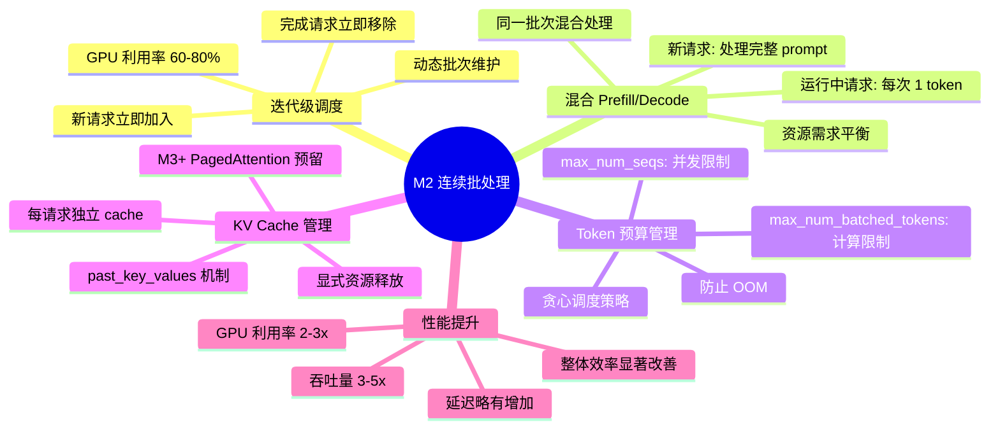

### 关键设计决策回顾

1. **为什么使用 FCFS 队列？**
   - 简单公平
   - 避免饥饿
   - 易于实现

2. **为什么分离 NewRequestData 和 CachedRequestData？**
   - 减少通信开销
   - 支持增量更新
   - 提高效率

3. **为什么 M2 每个请求单独执行？**
   - HuggingFace 模型限制
   - 实现简单
   - 为 M3 铺路

4. **为什么需要 Token 预算管理？**
   - 控制计算量
   - 避免 OOM
   - 保证响应性

### M3+ 扩展方向

```python
# M3: PagedAttention 真正批处理
def execute_model_batch_paged(self, input_batch):
    """M3+ 将实现的真正批处理"""
    
    # 1. 分配 KV cache 块
    block_tables = allocate_kv_blocks(input_batch)
    
    # 2. 真正的批处理前向传播
    logits = paged_attention_forward(
        input_batch.token_ids,
        block_tables,
        self.kv_cache_blocks,
    )
    
    # 3. 返回所有请求的 logits
    return split_logits_by_request(logits, input_batch)

# M3+: 抢占和交换
def handle_memory_pressure(self):
    """处理内存压力"""
    
    if memory_usage > threshold:
        # 选择抢占请求
        victim_requests = select_preemption_victims()
        
        # 交换到 CPU
        for request in victim_requests:
            swap_out_request(request)
```

### 学习要点

1. **系统思维**: 理解各组件如何协作
2. **接口设计**: 清晰的抽象和职责分离
3. **资源管理**: Token 预算和内存管理
4. **扩展性**: 为未来功能预留接口

---

## 🎤 结束语

今天我们从零开始实现了一个连续批处理系统，看到了：

1. **问题分析**: 传统批处理的效率问题
2. **架构设计**: 调度器、执行器、协调器的分工
3. **核心算法**: 动态调度和资源管理
4. **完整流程**: 从请求到输出的全过程
5. **扩展方向**: M3+ 的改进空间

连续批处理是现代 LLM 推理系统的基础，掌握了这个技术，你就理解了高性能推理框架的核心原理。

**下一步**: 我们将实现 PagedAttention，进一步提升内存效率和批处理能力！

谢谢大家！有什么问题吗？ 🙋‍♂️
