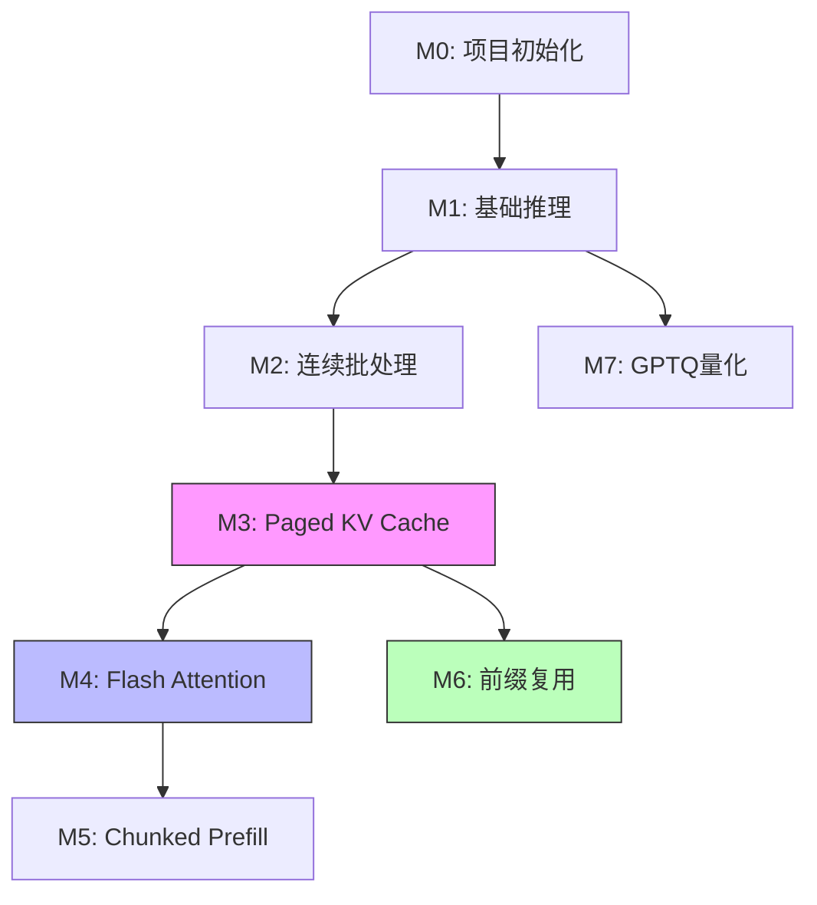

# FoloVLLM 技术路线图

## 📈 渐进式开发流程图

```
M0: 项目初始化
    ↓
M1: 基础离线推理 (单请求、连续KV Cache)
    ↓
M2: 连续批处理 (动态调度、多请求并行)
    ↓
M3: Paged KV Cache (内存优化、PagedAttention)
    ↓
M4: Flash Attention (计算优化、降低延迟)
    ↓
M5: Chunked Prefill (TTFT优化、混合调度)
    ↓
M6: 前缀复用 (缓存复用、加速预填充)
    ↓
M7: GPTQ量化 (显存优化、4-bit推理)
    ↓
🎉 完整的轻量级推理框架
```

## 🎯 各阶段核心目标

### M0: 项目初始化
**关键词**: 基础设施、模型加载、配置管理

**核心产出**:
- 项目目录结构
- 配置系统 (ModelConfig, SchedulerConfig, CacheConfig)
- 模型加载器 (支持 HuggingFace)
- 基础数据结构 (Request, Sequence, SamplingParams)

**技术难点**:
- 统一的配置管理
- 模型权重的高效加载

---

### M1: 基础离线推理
**关键词**: Forward Pass、Sampling、连续KV Cache

**核心产出**:
- LLMEngine 基础实现
- Transformer forward pass
- Greedy/Top-k/Top-p Sampling
- 简单的连续 KV Cache

**技术难点**:
- KV Cache 的维护和更新
- 多种采样策略的实现
- Attention mask 的正确构建

**性能基线**:
- 单请求推理延迟
- Token 生成速度

---

### M2: 连续批处理
**关键词**: Dynamic Batching、Scheduler、并行处理

**核心产出**:
- Scheduler (请求队列、优先级)
- 动态 Batch 组装
- 请求生命周期管理
- 抢占和恢复机制

**技术难点**:
- 不同长度序列的对齐
- 动态添加/移除序列
- Batch 状态的正确维护

**性能提升**:
- 吞吐量: **3-5x** ↑
- GPU 利用率显著提升

---

### M3: Paged KV Cache
**关键词**: PagedAttention、Block Manager、内存优化

**核心产出**:
- Block Pool Manager
- 逻辑到物理 block 映射
- PagedAttention 算子
- Copy-on-Write 机制

**技术难点**:
- Block 分配算法
- Attention 计算适配分页内存
- 碎片化管理

**性能提升**:
- 显存利用率: **接近 100%** (vs ~20% 传统方式)
- 支持更大 batch size
- 显存占用: **2x** ↓

**关键数据结构**:
```python
block_table: List[int]  # 逻辑块 -> 物理块 ID
block_pool: Tensor      # 物理内存池
ref_count: Dict[int, int]  # 块引用计数
```

---

### M4: Flash Attention
**关键词**: 优化算法、HBM访问、IO感知

**核心产出**:
- Flash Attention 2 集成
- Attention Backend 抽象
- Prefill/Decode 统一处理

**技术难点**:
- Flash Attention 与 Paged KV 的适配
- 不同 backend 的正确切换

**性能提升**:
- Attention 计算: **1.5-2x** ↑
- 延迟: **20-30%** ↓
- 支持更长上下文

**优化原理**:
- Tiling: 分块加载到 SRAM
- Recomputation: 避免存储中间结果
- Kernel fusion: 减少 HBM 访问

---

### M5: Chunked Prefill
**关键词**: 分块处理、TTFT优化、混合调度

**核心产出**:
- Prefill 分块逻辑
- Prefill-Decode 混合调度
- 动态 chunk size 调整

**技术难点**:
- Chunk size 的选择策略
- Prefill 和 Decode 的资源平衡
- 状态转换的正确管理

**性能提升**:
- TTFT (Time to First Token): **显著降低**
- 减少 head-of-line blocking
- 吞吐量和延迟更平衡

**调度示例**:
```
传统: [Prefill_1000_tokens] -> 阻塞其他请求
Chunked: [Prefill_256] + [Decode * N] -> 交替执行
```

---

### M6: 前缀复用
**关键词**: Prefix Caching、Trie、共享内存

**核心产出**:
- Token 序列哈希
- 前缀树 (Trie) 匹配
- Block 共享机制 (COW 完善)
- LRU 缓存淘汰

**技术难点**:
- 高效的前缀匹配算法
- 引用计数的正确维护
- 缓存淘汰策略

**性能提升**:
- TTFT: **3-10x** ↓ (缓存命中时)
- 显存复用率提升

**应用场景**:
- Few-shot prompting (共享示例)
- 多轮对话 (共享历史)
- 批量请求 (共享 system prompt)

**数据结构**:
```python
prefix_trie: TrieNode       # 前缀树
token_to_hash: Dict         # Token序列 -> Hash
hash_to_blocks: Dict        # Hash -> Blocks
```

---

### M7: GPTQ 量化
**关键词**: 4-bit量化、权重压缩、精度保持

**核心产出**:
- GPTQ 权重加载
- 量化算子集成 (AutoGPTQ)
- 反量化推理逻辑

**技术难点**:
- 量化精度损失控制
- 量化算子的正确使用
- 性能和精度平衡

**性能提升**:
- 显存占用: **4x** ↓
- 推理速度: **1.2-1.5x** ↑ (部分场景)
- 精度损失: **< 1%** (perplexity)

**量化流程**:
```
原始模型 (FP16) -> GPTQ量化 -> 4-bit权重 + Scale/Zero-point
                              ↓
                         运行时反量化 -> 计算
```

---

## 🔄 技术依赖关系



**关键依赖**:
- M3 是后续优化的基础 (Paged KV)
- M4 依赖 M3 的分页内存结构
- M6 依赖 M3 的 block 共享机制
- M7 相对独立，可以并行开发

---

## 📊 性能演进路径

### 延迟优化路径
```
M1 (基线)
    ↓
M4 (Flash Attention: -20~30%)
    ↓
M5 (Chunked Prefill: TTFT 显著改善)
    ↓
M6 (Prefix Cache: 缓存命中 -90%)
```

### 吞吐量优化路径
```
M1 (基线)
    ↓
M2 (Continuous Batching: +3~5x)
    ↓
M3 (Paged KV: 更大 batch)
    ↓
M4 (Flash Attention: +1.5~2x)
```

### 显存优化路径
```
M1 (基线)
    ↓
M3 (Paged KV: -50%)
    ↓
M7 (GPTQ: -75%)
    ↓
最终: 显存占用 ~6% 初始值
```

---

## 🎓 学习重点

### 必须深入理解的概念

1. **KV Cache 机制** (M1)
   - 为什么需要 KV Cache？
   - 如何维护和更新？

2. **动态批处理** (M2)
   - Iteration-level scheduling
   - 请求生命周期管理

3. **PagedAttention** (M3)
   - 虚拟内存思想在 LLM 的应用
   - Block 分配和回收算法

4. **Flash Attention** (M4)
   - IO-aware 算法设计
   - Tiling 和 recomputation 权衡

5. **Chunked Prefill** (M5)
   - Prefill-Decode 的本质区别
   - 如何平衡 TTFT 和吞吐量

6. **Prefix Caching** (M6)
   - 前缀匹配算法
   - Copy-on-Write 机制

7. **GPTQ 量化** (M7)
   - 权重量化原理
   - 量化误差控制

---

## 🔍 面试高频问题

### 系统设计类

1. **如何设计一个高性能的 LLM 推理系统？**
   - 答案涵盖: M2 → M3 → M4 → M5

2. **如何优化 LLM 推理的内存占用？**
   - 答案涵盖: M3 (Paged KV) + M7 (量化)

3. **如何降低首 token 延迟？**
   - 答案涵盖: M5 (Chunked Prefill) + M6 (Prefix Cache)

### 技术深度类

4. **PagedAttention 和传统 Attention 的区别？**
   - 重点: Block 分配、内存映射、碎片化

5. **Flash Attention 为什么快？**
   - 重点: IO 复杂度分析、Tiling、Recomputation

6. **Continuous Batching 如何实现？**
   - 重点: 动态调度、Padding 处理、状态管理

7. **前缀复用的实现原理？**
   - 重点: Trie 匹配、COW、引用计数

### 权衡取舍类

8. **Chunked Prefill 的 chunk size 如何选择？**
   - 考虑: TTFT、吞吐量、GPU 利用率

9. **量化带来的精度损失如何评估？**
   - 指标: Perplexity、下游任务性能

---

## 📅 开发检查清单

### 每个 Milestone 完成前

- [ ] 功能实现完整
- [ ] 单元测试覆盖 > 80%
- [ ] 集成测试通过
- [ ] 性能测试完成 (有优化时)
- [ ] 学习笔记编写 (技术原理 + 面试题)
- [ ] 开发日志更新 (功能 + 问题 + 接口)
- [ ] 代码注释清晰
- [ ] README 状态更新

### 性能测试项

- [ ] 延迟指标 (TTFT, TPOT, E2E)
- [ ] 吞吐量指标 (Tokens/s, Requests/s)
- [ ] 资源指标 (显存、GPU 利用率)
- [ ] 质量指标 (与原模型对比)
- [ ] 优化前后对比数据

---

## 🚀 快速参考

### 运行测试
```bash
# M1: 基础推理测试
python examples/basic_inference.py

# M2: 批处理测试
python examples/batch_inference.py

# M3: Paged KV 测试
pytest tests/unit/test_block_manager.py

# 性能 Benchmark
python tests/benchmark/run_benchmark.py
```

### 关键文件速查（对齐 vLLM v1）

| 功能         | FoloVLLM 文件                            | vLLM v1 对应文件                     |
| ------------ | ---------------------------------------- | ------------------------------------ |
| 推理引擎     | `folovllm/engine/llm_engine.py`          | `vllm/v1/engine/llm_engine.py`       |
| 调度器       | `folovllm/core/sched/scheduler.py`       | `vllm/v1/core/sched/scheduler.py`    |
| KV Cache     | `folovllm/core/kv_cache_manager.py`      | `vllm/v1/core/kv_cache_manager.py`   |
| Block Pool   | `folovllm/core/block_pool.py`            | `vllm/v1/core/block_pool.py`         |
| Attention    | `folovllm/attention/backends/`           | `vllm/v1/attention/backends/`        |
| 采样         | `folovllm/sample/sampler.py`             | `vllm/v1/sample/sampler.py`          |
| 模型         | `folovllm/model_executor/models/qwen.py` | `vllm/model_executor/models/qwen.py` |
| Worker       | `folovllm/worker/gpu_worker.py`          | `vllm/v1/worker/gpu_worker.py`       |
| Model Runner | `folovllm/worker/model_runner.py`        | `vllm/v1/worker/gpu_model_runner.py` |

---

## 📚 推荐学习顺序

1. **理论准备** (1-2天)
   - 阅读 vLLM 论文
   - 理解 Transformer 推理流程
   - 了解 KV Cache 概念

2. **实践开发** (按 M0-M7 顺序)
   - 每完成一个阶段，阅读对应学习笔记
   - 运行性能测试，理解优化效果
   - 对比 vLLM 源码，理解异同

3. **深度优化** (可选)
   - 尝试不同超参数配置
   - 分析性能瓶颈
   - 探索进一步优化空间

4. **面试准备**
   - 总结每个阶段的核心概念
   - 准备技术追问的回答
   - 整理项目亮点

---

**下一步**: 开始 [Milestone 0](../docs/dev/milestone_0.md) - 项目初始化

